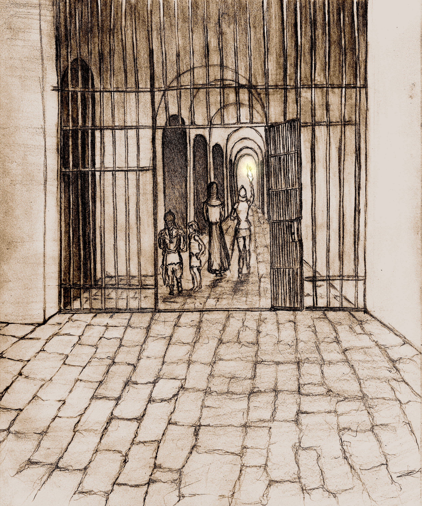
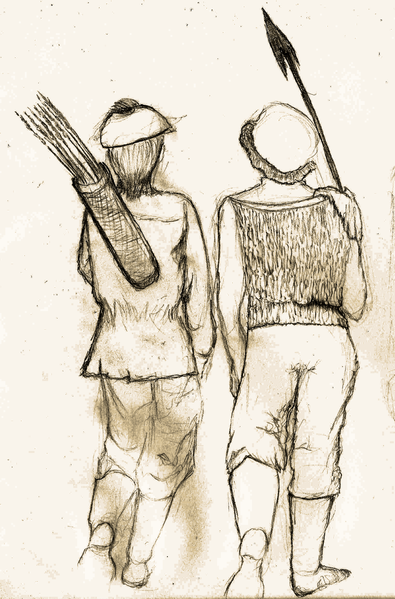

<!-- <link rel="preconnect" href="https://fonts.googleapis.com">
<link rel="preconnect" href="https://fonts.gstatic.com" crossorigin>
<link href="https://fonts.googleapis.com/css2?family=Manufacturing+Consent&family=Metamorphous&family=New+Rocker&family=Uncial+Antiqua&display=swap" rel="stylesheet">

 -->

The Hunt for the Treasure  of Aural Hall
==============

***A BIT-Mysteries Solo & COOP RPG Campaign Powered by the DepthRangers RPG System***

# Beginner Adventurer's Guide

**Authors:** *Eduardo del Corral, Ehira Lira & Hyunjin Oh*

**Portrait Illustration:** *Ehira Lira*

**Layout Design and Digital Imaging:** *Eduardo del Corral*

---------------------------------------

This short book is an instruction manual for playing **The Hunt For The Treasure Of Aural Hall**, which is a **DepthRangers** RPG System campaign. **DepthRangers** is an Open-Source rules-light combat heavy system that uses *d6* exclusively and focuses on fast paced action.

This guide contains all the information you should need to get started. We hope you enjoy this product, please share with your friends and colleagues. Thanks for Downloading!

This System and Campaign are licensed under **CC-BY-SA**.

## Table of Contents

* [Introduction](#introduction)
  * [Game Overview - Interview With An Adventurer](#game-overview---interview-with-an-adventurer)
* [Materials needed for play](#materials-needed-for-play)
  * [List Of Materials Needed](#list-of-materials-needed)
* [Character creation](#character-creation)
  * [Races](#races)
  * [Classes](#classes)
  * [Base Character Stats](#base-character-stats)
    * [HP](#hp)
    * [Armor Class](#armor-class)
    * [Saves](#saves)
    * [Money](#money)
    * [Inventory](#inventory)
    * [Starting Gear](#starting-gear)
  * [Character Templates](#character-templates)
    * [A Balanced Party](#a-balanced-party)
* [Gameplay Fundamentals](#gameplay-fundamentals)
  * [Goal Of The Game](#goal-of-the-game)
  * [Game Progression](#game-progression)
  * [Quests](#quests)
* [Your first quest](#your-first-quest)
* [Supplies](#supplies)

* [Guided tour into the dungeon - Heading for the entrance](#guided-tour-into-the-dungeon---heading-for-the-entrance)
  * [Important terminology](#important-terminology)
    * [Dungeon Level](#dungeon-level)
    * [Character Level](#character-level)
    * [Party Size](#party-size)
  * [Decide Who Will Be The Torch Bearer](#decide-who-will-be-the-torch-bearer)
  * [Order of Play](#order-of-play)
    * [During battle](#during-battle)
    * [Quest Completion Cycle](#quest-completion-cycle)
    * [Party and Dungeon levels](#party-and-dungeon-levels)
  * [Exploring the dungeon](#exploring-the-dungeon)
    * [The Discovery Phase](#the-discovery-phase)
      * [Determining The Layout Of A Room](#determining-the-layout-of-a-room)
        * [Location Of The Dungeon Exit](#location-of-the-dungeon-exit)
      * [Determine the contents of that room](#determine-the-contents-of-that-room)
      * [Charting Your Progress](#charting-your-progress)
    * [The Backtracking Phase](#the-backtracking-phase)
    * [Stairs](#stairs)
* [Character Death](#character-death)
* [End Of Training](#end-of-training)

## Introduction

*Citizen*: "Welcome to the settlement traveler, you'll find people from all walks of life including merchants, Inn keepers, our own regional branch of government... But, most importantly, our explorer community guild who call themselves: **DepthRangers**. Sounds like that interests you... Perhaps you should talk to that adventurer over there."

### Game Overview - Interview With An Adventurer 

*Adventurer*: "Hello Traveler! So you're interested in the life of an adventurer? Sure let me tell you a bit about what we do..."

"We, the **DepthRangers** are a community of explorers who challenge the mysteries of the underground labyrinthine structure. Nobody knows how old, wide or deep this structure is; and that is because: on one hand it's extremely difficult to navigate, but on the other the extreme danger found within."

"For us *"fame, fortune and despair"* lie at the bottom of this structure, in the depths of what we call the Dungeon. I see a twinkle in your eye... perhaps you should head to the office to enroll in the guild. Goodbye and best of luck!"

## Materials needed for play

*Clerk*: "Welcome to the **DepthRangers** guild, where we handle all sorts of underground exploration requests. From a lost pet, to making contact with an unknown plane of existence. This job is its own reward, though the riches found along the way provide an extra incentive."

"We are always happy to receive new recruits and understand just how challenging it can be to get started, but worry not you'll soon be diving into the underground structures like the best of them."

"Before we get started let me make sure you have everything you need..."

### List Of Materials Needed

To play this game you will need:

* The different booklets that make up the Hunt for the Treasure  of Aural hall including:
  1. Beginner's Adventure Guide (this)
  2. [Quest Catalog](https://github.com/BajaInnoTech/hunt_for_the_treasure_of_aural_hall/blob/master/PDFs/2.%20Quest%20Catalog.pdf)
  3. [Field Guide](https://github.com/BajaInnoTech/hunt_for_the_treasure_of_aural_hall/blob/master/PDFs/3.%20Field%20Guide.pdf)
  4. [Navigation Charts](https://github.com/BajaInnoTech/hunt_for_the_treasure_of_aural_hall/blob/master/PDFs/4.%20Navigation%20Charts.pdf)
  5. [Monster Almanac](https://github.com/BajaInnoTech/hunt_for_the_treasure_of_aural_hall/blob/master/PDFs/5.%20Monster%20Almanac.pdf)
* At least 1d6 (six sided die); though preferably, more of these - around 3 or 4. You can use an app [or website instead](https://www.online-stopwatch.com/online-dice/).

* Sheets of paper to map your dungeon. While we recommend you use graph paper, [you could consider using an app or website instead](https://virtual-graph-paper.com/).
* A pencil & eraser per player (you can share the same one if needed)
* Yourself & possibly even a friend or two.

*Clerk*: "Check that you have everything you need and I'll gladly register you..."

## Character creation

*Clerk*: "Ok one more thing before I hand out the registration sheet, lets make sure that you have a balanced party. There are multiple professions and species of adventurers. It is generally advisable to have one of each in your party. Here's an overview of the different profiles of adventurers you may wish to enroll:"

### Races

*These are the different species of adventurers currently interested in exploring:*

* *Human*: Humans have no penalties or bonuses to their saves, what they have is re-roll dice that they can make use of in any context they wish (including the room layout or during quest selection). They gain an additional dice every two levels, and recover one spent dice each time they rest (just one folks).
* *Elf*: Elves are not as resilient as humans but they are more dexterous and magically inclined. Additionally their keen senses can be very handy.
* *Dwarf*: Dwarfs are less agile than their peers, but they are hardier. Additionally, dwarfs don't need to use torches to see, so technically a purely dwarven party would not need torches.
* *Brownie*: Slightly shorter and leaner than humans, brownies are dexterous when handling locks/traps. They also have a deep bond with animals capable of communicating with them. Brownies can't be healers.

### Classes

*Clerk*: "And these are skills they tend to specialize in:"

* *Fighter*: A trained combatant capable of using any weapon/armor they find, and can produce extra attacks.
* *Healer*: Healers are defensive magic specialists, focused mostly on keeping the party healthy though they can also make use of some scrolls and are somewhat resilient.
* *Mage*: Versatile casters that can make use of both defensive and offensive magic as well as any scroll. They have a helpful attunement to magic but are somewhat fragile.
* *Paladin*: Holy Warriors who bring the might of their faith to the frontlines. They have an extraordinary talent for combating evil and defeating the undead, however they have certain restrictions that can make them less versatile than Figthers.
* *Rogue*: Capable of deadly combat maneuvers and able to handle traps, treasure and locks with unparalled proficiency. Additionally, they are able to use magic equipment.

### Base Character Stats

*Clerk*: "You should know about these since the Class and Race you choose have a direct impact on most and all of them are fundamental for survival (including money). So..."

These generic stats are what you use when creating different characters, some races & classes will require adjusting these values.

#### HP

How resilient to damage your character is. The base HP for characters is *(1d6+3)* HP on their first level plus an additional *1d6* HP each level.

#### Armor Class

Equipping armor is vital to surviving your adventures. You subtract the damage you receive by the total amount of armor class or "*AC*" you have. Your maximum armor is determined by the armor you can equip yourself with. Though there are some restrictions on who can use which gear.

#### Saves

A save is thrown when an extraordinary feat must be accomplished (such as avoiding a deadly trap).

All characters have 3 types of saves:

* **Body**: Used for bodily resistance (fort), as well as raw physical prowress (strength).
* **Dex**: Dexterity saves are used when performing acrobatic maneuvers, sneaking and other maneuvers and skills that require fine motor skill control or quick reaction times.
* **Magic**: Magic saves are used when tapping into or resisting magic, spiritual and transcendental experiences, will power, intellect, etc.

*The baseline for all saves is 4.*

When asked to roll for a save a *d6* is thrown, if the value is equal to or greater than the character's save the save is successful otherwise it fails.

While saves generally require a roll of *4* or greater, some races have bonuses and penalties that will change this amount. So be sure to account for these bonuses and penalties in your character sheet.

#### Money

The currency of this game is gold, and "g" is the unit. Your character starts out with *1d6\*20*g and will gain more gold from completing quests and selling items. You'll use this to purchase items, use services and even bribe receptive monsters into giving you information.

#### Inventory

Your cargo capacity. Each character has *10* available inventory slots, so long as they don't fatigue.

#### Starting Gear

You start out with 5 torches and 5 rations, be sure to assign each to a different slot in your inventory (meaning you have 8 available slots from the 10 you started with).

### Character Templates

*Clerk*: "Phew, that was a mouthful but worry not. Here are your registration forms. We tried making it as easy as possible to get started. Just take the ones that you need. Take your time, I'll be here at the desk when you're done."

Once you've seen the kinds of combinations that appeal to you, we recommend that you take a look at the character templates we provide. We created a template for each combination of Race & Class. Be sure to read the fine print so you know how to get started and any special details that apply to that type of character. Don't forget to perform your HP rolls, your roll for your gold, and choose your spells if that applies so you're ready for the next steps.

If you want a clearer explanation, check out the **Character Creation Guide**. You'll find the details of each Race and Class. While you could use this information to create your characters from scratch, using our templates makes things easier.

#### A Balanced Party

As you create your characters, make sure to have a balanced party of preferably 4. One balanced party suggestion is:

* Human - Fighter
* Elf - Mage
* Dwarf - Healer
* Brownie - Rogue

This way, you gain the benefits of each... but the decision is entirely up to you!

## Gameplay Fundamentals

*Clerk*: "Ok, thanks for handing your personal details in. You're now officially a member!"

"But, before you can begin your life as an adventurer we still need you to undergo a brief training session. Fortunatey, a training session is about to start, please head to the room at the right..."

<figure>
  

  <i>
<figcaption>More adventurers seem to be headed to the training room.</figcaption>
</i>
</figure>

*As you step into the room you're greeted by a scarred Elf who points towards a seat...*

*Trainer*: "Welcome, we're about to begin..."

### Goal Of The Game

The goal of this campaign is stated in the name, to be the one who succeeds in **The Hunt For The Treasure Of Aural Hall**. However, know that this early release still has a fraction of the full Campaign... But worry not, there is already a lot to do here, and much more will be added soon...

### Game Progression

Game progression happens by successfully completing *Quests*. Each quest requires entering the *Dungeon*, completing one or more objectives, then making your way back safely. Back in town you can acquire goods and perhaps replace fallen adventurers. Each time you succeed in a quest you'll find returning to the *Dungeon* poses a greater threat as you advance in your adventuring career.

### Quests

Characters will level up by correctly completing *Quests* (though there might be a few exceptions). They must have leveled up 4 times before they can try their hand at finding **The Treasure Of Aural Hall**. These *Quests* determine the goal of the dungeon crawl and vary from one entry to another.

In the hope of maintaining replay value by ensuring a wide variety of play experiences, there have been some twists applied to the quest-mechanic from one *Quest* to another. Hence there are many types of *Quests* with many iterations of each present in this release or planned for the next. No two play experiences should be the same!

Some of the types of *Quests* you will find include:

* Escort/Subdue missions
* Clues/Preparation
* Retrieval/Discovery/Merchantile
* Time/Movement sensitive quests

In short, expect each entry into the *Dungeon* to be a very different experience.

## Your first quest

*Trainer*: "Once you created your party, you should talk to the guild clerk and request a quest. The clerk will take a look at its records then assign you an objective that must be fulfilled within the Dungeon."

To select your first quest, open the **Quest Catalog** booklet and roll a *d6*. Check the listings, and receive the quest.

*Trainer*: "The guild will inform you what the goal of your journey into the dungeon is. Read the objective carefully. Now go and get your quest then come back here!"

## Supplies

*Trainer*: "Very well, have 5 torches and rations courtesy of the guild. However this is not enough to successfully complete your missions. And so, we're heading now to the market. Bring your gold as the rest of the supplies are now on you."

"Don't worry, I'll explain the details on the way!"

If you used the provided character templates, you should have already determined how much gold each character has (otherwise please review that before proceeding).

*Trainer*:  "We at the DepthRangers guild have an understanding with the sellers, and managed to negotiate some bundled offers for first time adventurers. These should fit different budgets and needs. Keep in mind that you should always have a blend of melee and ranged combatants, and every member of your party should have their own thief's tools."

* Basic package, 30 g:
  * One Single Handed Weapon
  * 3 Thief's tools
  * 3 Bandages
* Junior Adventurer package, 60 g:
  * Single Handed Weapon
  * Shield
  * Healing Potion
  * 3 Thief's tools
  * Fire Oil
* Ranged package, 50 g:
  * One Ranged Weapon
  * 10 arrows
  * 3 thief's tools
  * 3 bandages

After reviewing the packages, it's time to open the **Field Guide** booklet, and look at the Market Wares section. Fist time users would benefit from reading the rest of the guide (before purchasing any items) in order to get the things they actually need. In any case, whatever you choose, we recommend that your purchase includes:

* A weapon for each member of your party. We strongly recommend a mix of melee and ranged weapons between your party members. But, always keep in mind someone will need a free hand to hold a torch (more on this later).
* Purchase bandages & thieves tools for every party member as well. You start out with 5 rations & 5 torches which is indicative of how important these provisions are (make sure to keep stock); all characters need rations to rest, and if you have a brownie in your party they're also helpful in befriending animals. Remember no thief's tools NO TREASURE and traps can't be disarmed without them either, and each character must have their own kits on hand to deal with either traps or treasure when found!
* And whenever possible, equip some basic armor.

*Every trader you find, regardless of their specialty or location, will purify expired goods for 1g (per piece) as a service to explorers. This is spelled out on your Field Guide in the market place entry but it's up to the players to remember this point.*

## Guided tour into the dungeon - Heading for the entrance

*Trainer*: "Well, now that you have sorted out your equipment and provisions, it's time to head to the Dungeon. I'll provide the last bit of training on the way."

### Important terminology

Let's just get a few things clear, you'll really need them later:

* *dungeon_level*
* *character_level*
* *party_size*

Because you may choose not to print this booklet and just the others, you'll find all of these also described in the field guide.

#### Dungeon Level

This is the level you're currently at in a dungeon. Dungeon levels start at 0, and increase each time you go down a flight of stairs.

As you'll read later, each time you level up, you must go to a higher dungeon level to complete the next quest.

You'll often see the dungeon level used for calculations, so keep this in mind.

You'll see it in calculations as: *dungeon_level*

#### Character Level

This is the level of your playable character. It starts at 1, and increases each time you finish a quest successfully (there might be a few exceptions).

This should be the same for the entire party since they all level up at the same time.

You'll see it in calculations as: *character_level*

#### Party Size

The amount of playable characters that enter the dungeon. By default this number is expected to be 4, the entire game was designed around this premise. However, we tried to make it flexible so that different sized parties could be played as well. It's up to the actual players reading this document how large your party will be.

A larger party will usually have an easier time, though this is not always the case since some mobs and bigger enemies scale depending on party size. Still, in theory, it should be possible to do this with parties as small as 2 and as large as needed. Though, I'd expect the game to become unbalanced if you deviate too much from 4.

Because this value is very frequently used, I recommend you write down these three quantities:

* *party_size*
* *party_size/2* - rounded down (no fractions)
* *party_size/3* - rounded down (no fractions)

*Ignore the fractions in any calculations you do.*

### Decide Who Will Be The Torch Bearer

*Trainer*: "Listen, unless you can see in the dark there has to be light source or you will be slain by the many dangers in the dungeon. The normal way of going about this is to designate a torch bearer, so choose who among you will hold the torch at the entrance. Additionally, you'll need to renew your torch while using the stairs."

Select a character that will hold the torch until you reach a set of stairs. At which point, you may change the torch bearer for another character before moving on from the stairs. The chosen character will be holding a torch on one of its hands, hence it will not be able to use a shield or a two handed or ranged weapon (it can still use a scroll however, nod nod wink wink).

The torch bearer will decrease the number of torches it holds upon entering the dungeon gate. Each flight of stairs, a new torch must be lit. It does not matter if you're descending or ascending, you still need a new torch - so be deliberate when you decide to turn back. You can change who the torch bearer will be each time you expend a torch.

Any character that is not a Dwarf, will die automatically if your party runs out of light. And, while there are magical means to provide illumination... torch bearers are far less expensive.

### Order of Play

When playing solo, things are very simple, your party is delving into the dungeon. You take control of all characters and monsters.

If you play using COOP, then you have two choices:

* *RPG Mode:* Party members divide characters among themselves: During exploration, turn alternates between one player and another. During your encounters, divide the monsters among yourselves combat goes in the order of your characters, then a second round is done with the monsters. If there's only one monster the last player rolls for the monster.
* *Board Game Mode:* Players take turns:
  * When reading a quest, perform an action (such as disabling a trap or performing a maneuver) or select a choice
  * During combat, each player takes control of the next character or monster
  * During exploration, each player can perform one of the following:
    * Explore a new room
    * Explore a space inside the staircase
    * Revisit rooms until a hazard die is thrown or the quest is completed

Combat and exploration will be described soon, however the key takeaway is you can trade turns between monsters and characters or divide these ahead of time between players.

#### During battle

This is described in detail in the *Combat Order* section of your **Field Guide**. The quick version is, to strike first:

* *Normal Encounters*: To strike first, roll *(4-character_level+dungeon_level)*
* *Quest Encounters*: To strike first, roll *(5-character_level+dungeon level)*
* *Boss Encounters*: Bosses strike first.

*I recommend that you revisit this section as more of these concepts become familiar.*

#### Quest Completion Cycle

In this phase, your party attempts to fulfill the assigned quest. First entering the dungeon, then upon completion, returning to the surface and resupplying, recovering and trading before requesting a new quest and repeating the process.

All quests start at ground level which is **Level 0**. Each time you enter a room you'll start by first learning its layout, then its contents. The layouts describe the different exits available... Some of them can be seen with the naked eye while others are hidden. The contents usually tell you what can be found inside the room. If there are multiple players, remember to take turns leading the exploration.

Note that each time a party exits the dungeon and successfully completes a quest, for their next quest, they must descend *one level deeper* than the previous delve.

#### Party and Dungeon levels

As previously mentioned, only the first quest can be solved at **Level 0**, all other quests require you to descend deeper to fulfill your goal. To reach a lower level, you must explore different rooms until you find a flight of stairs (see stairs).

If all pathways are closed off and you're unable to descend as needed, then you must return to the surface then try again. As each time you enter the dungeon, the layout changes allowing another chance at completing your mission.

In other words, after increasing your party's level you need to go one level deeper into the dungeon and at higher levels the risk is greater and it takes longer.

### Exploring the dungeon

*Trainer*: "Alright people, we're getting close to the entrance so pay special attention, soon you'll be on your own..."

Exploring a dungeon is basically done in two phases:

1. The Discovery Phase
2. The Backtracking Phase

#### The Discovery Phase

This is what happens when you are still underway and heading to new rooms. One thing to keep in mind is that *each time you enter a dungeon, the dungeon changes its layout.*

The Discovery phase itself has two key steps:

* Determine The Layout Of A Room
* Discover The Room's Contents

##### Determining The Layout Of A Room

Upon entering a room, its layout will be revealed. To do this, open up your *Navigation Charts*, then check the *Room Layout* section. You'll find all the possible layouts listed here.

Roll a *d6* to determine what that room looks like and chart that location in a sheet of paper while we recommend you use graph paper for this, [you could consider using an app or website instead](https://virtual-graph-paper.com/).

###### Location Of The Dungeon Exit

Upon entering the dungeon, you must mark the location of the starting room. Do this now!

This first room is very special, since your entrance will later be the exit of the dungeon. So be sure to *mark your entrance* with an arrow or other symbol for when you want to make your way out of the dungeon and return to the surface.

##### Determine the contents of that room

Once you know the layout, the next step is to describe what your party finds inside that room. Open up your **Navigation Charts** again and roll a *d6*. Look up the "*Room Contents Table*" to determine what your party found in that room.

If they discover a flight of stairs, they will traverse them. After dealing with the events that take place on the stairs, you will eventually make your way to level 1. And though you will need to descend into greater depths later, for now simply just deal with the outcome by following the instructions then make your way back to level 0 to complete your first quest.

Whenever you find a flight of stairs be sure to mark it for the same reasons you marked the dungeon entrance. You will need them to exit the dungeon later.

##### Charting Your Progress

It's recommended that you keep a log of your quests. Some of these things may be needed later, but more importantly this allows you to resume the game some other time (for example when playing during a lunch break). Also keep a separate sheet for each map, and preferably record each level on separate sheet of paper or section so they don't overlap.

#### The Backtracking Phase

When the layout of a room leads to a wall in an adjacent room you previously charted, any doors indicated are ignored (after all, a door that leads to a wall is not very helpful). Hence you may find yourself in need of backtracking, to find another way to advance. You also may need to revisit rooms if you are searching for a secret door or the dungeon layout closed in on itself.

Likewise, when you finish your quest, you must return to the surface and will backtrack revisiting the rooms you entered on your way there.

This is known as the backtracking phase, where you are either looking for something, ran into a dead end or are making your way back after completing the quest.

In theory it's simple, all you have to do is to return the same way you got in. But you will revisit the rooms you already discovered, which means you will be rolling hazard die. Suffice to say that you should read the *Hazard Dice And Non Combat Events* section of your **Navigation Charts**.

#### Stairs

When you're in level 0, any flight of stairs you find will lead you downwards. However the room you land on, is a new floor of the dungeon. Each time you descend a floor you increase the *Dungeon Level* by 1. Notate that location of the staircase entrance and the staircase in the new floor, because when you come back to it, that staircase will lead you back to a floor above.

There are exceptions to this behavior, but how stairs will work will be described in detail for said quests.

Stairs are a good place for a snack, players can optionally eat 1 provision of rations when descending or going up a staircase. Eating a portion of rations will recover *(character_level)* HP and remove *1* round of fatigue (recover 1 fatigued slot). Note that you must explore the dungeon before eating again (after all you don't want to battle heartburn while fighting monsters).

## Character Death

*Trainer*: "Remember you are officially a member of the guild, you likeness will be shown in our local gazette. We hope it will take much longer to print your obituary, though that is a service we also provide to our members... In these cases, if any of you survives you should have no issues recruiting other members back at the guild."

The settlement does not have people that can revive on retainer, sometimes they can bring people from the capital but they can arrive too late (not to mention the expense). In other words, be careful!

## End Of Training

*Trainer*: "Well we have arrived, come see me at the guild if you need a refresher. Be careful and pace yourselves. Good luck on your first quest!"

<figure>
  

  <!-- <i>
<figcaption>Four DepthRangers are determined to challenge the dangers of the dungeon.</figcaption>
</i> -->
</figure>