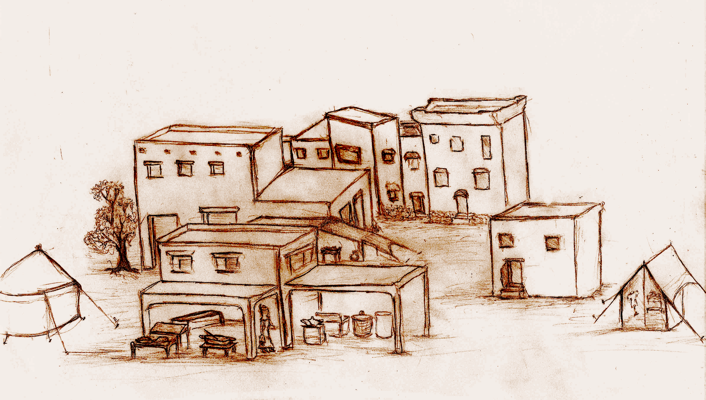

<!-- <link rel="preconnect" href="https://fonts.googleapis.com">
<link rel="preconnect" href="https://fonts.gstatic.com" crossorigin>
<link href="https://fonts.googleapis.com/css2?family=Manufacturing+Consent&family=Metamorphous&family=New+Rocker&family=Uncial+Antiqua&display=swap" rel="stylesheet">

 -->

# Field Guide

This field guide works as a dungeon preparation pamphlet. You'll find a description of common items and their uses here. As well as combat, skills and exploration mechanics.

This is also meant to be a reference guide. We are expecting readers to return frequently either to refresh or explain these concepts to other DepthRangers.

## Table of Contents

* [Market Wares](#market-wares)
* [Selling Gear \& Items](#selling-gear--items)
* [Exchanging Items Between Party Members](#exchanging-items-between-party-members)
* [Important Terminology](#important-terminology)
  * [Dungeon Level](#dungeon-level)
  * [Monster Level](#monster-level)
  * [Character Level](#character-level)
  * [Party Size](#party-size)
* [Combat](#combat)
  * [Combat Order](#combat-order)
  * [Melee Weapons](#melee-weapons)
  * [Ranged Weapons](#ranged-weapons)
  * [Empty Handed Fighting](#empty-handed-fighting)
  * [Attacking](#attacking)
    * [Critical Attack](#critical-attack)
      * [Critical Attack Table](#critical-attack-table)
    * [Normal Attack](#normal-attack)
    * [Attack Accuracy](#attack-accuracy)
      * [Single Handed and Ranged Weapon Accuracy](#single-handed-and-ranged-weapon-accuracy)
        * [Single Handed Weapon Accuracy Table](#single-handed-weapon-accuracy-table)
      * [Two Handed Weapons Accuracy](#two-handed-weapons-accuracy)
        * [Two Handed Weapon Accuracy Table](#two-handed-weapon-accuracy-table)
  * [Retreating From An Encounter](#retreating-from-an-encounter)
* [Hazard Dice And Non Combat Events](#hazard-dice-and-non-combat-events)
  * [Non Combat Event](#non-combat-event)
  * [Hazard Die Roll](#hazard-die-roll)
* [Out of combat transactions](#out-of-combat-transactions)
* [Searching](#searching)
* [Lock-picking](#lock-picking)
* [Trap Deactivation](#trap-deactivation)
* [Lingering Status Effects](#lingering-status-effects)
  * [Bleeding Status](#bleeding-status)
  * [Diseased Status](#diseased-status)
  * [Poisoned Status](#poisoned-status)
  * [Sprained](#sprained)
  * [Fatigue](#fatigue)
* [Finding Treasure](#finding-treasure)
* [Resting](#resting)
* [Illumination](#illumination)
* [Leveling Up](#leveling-up)

## Market Wares

This is a list of all the items you can find across the market's many shops. This should be more than enough for an eager explorer, though there are many things not found here which you may find beneath the surface.

<figure>
  

  <i>
<figcaption>There are all sorts of wares to be found in the many shops within the settlement.</figcaption>
</i>
</figure>

* **One-handed Weapons**: From blades to clubs, these are weapons that can be wielded with one hand alone. They inflict *(character_level)d6* damage, and cost 20g
  * Single handed Melee weapons can be used while holding a shield or a torch on the other hand.
  * One-handed Weapons take up 1 inventory slot.
* **Two-handed Weapons**: Larger weapons that require both hands to use, the wielder must be someone who can withstand both the weight and size of the weapon. They inflict *(character_level)d6+(character_level)* damage, and cost 50g
  * Can't equip a two handed weapon and a shield or hold a torch at the same time.
  * Two-handed Weapons take up 2 inventory slots.
* **Ranged Weapons**: Weapons that can be used to attack at a distance, they require both hands to use and consume ammunition. They inflict *(character_level)d6* damage, and cost 30g
  * Ranged Weapons take up 1 inventory slot.
* **Arrows**: Ammunition for your ranged weapon the cost per unit is 2g
  * You can store 10 arrows per slot.
* **Rations**: Edible if not flavorful; they can be stored for a considerable amount of time and will be needed should you find a place safe enough to rest within your travels. Rations are sold for single person lasting 1 day, they cost 3g
  * Each character must consume one set of rations per rest to gain its benefits.
  * Brownies can use rations to persuade animals.
  * You can store 5 rations per slot.
* **Torches**: They are used to see at a distance (30 ft radius), though monsters can see you as well. Torches are sold in sets of 3 and cost 5g
  * One character in your party must carry a torch instead of a shield or two handed weapon.
  * You can store 5 torches per slot.
* **Brigandine**: Light padded armor with minor steel plate reinforcements. It allows for ease of movement providing light protection. It offers +1 AC, and costs 50g
  * Light armor, can be used by all.
  * Takes up 2 inventory slots.
* **Chainmail**: Fortified armor made of interlocking metal rings, while it still offers protection and some mobility only someone with strong physical endurance can be comfortable with prolonged use. It offers +2 AC, and costs 100g
  * Fortified armor, can be used by most save Mages and non warrior brownies.
  * Takes up 2 inventory slots.
* **Platemail**: A particularly heavy armor made of metal plates. While well balanced, the wearer must be trained to use this outside an exhibition room. It offers +3 AC, and costs 200g
  * Strongest conventional armor, can be used by non brownie warriors and healers.
  * Takes up 3 inventory slots.
* **Helmet**: Head protection, while not too ornamented it sure is better than a bucket. It offers +1 AC, and costs 60g
  * Can be used by non brownies / mages.
  * Takes up 1 inventory slot.
* **Shield**: Made out of wood with iron supports. Bulky but able to take a couple of blows. It offers +1 AC, and an additional +1 AC against ranged attacks, and costs 30g
  * Can be used by non brownies / mages.
  * Takes up 1 inventory slot.
* **Spell Scroll**: Cheaply made but handy, use of scrolls saves precious spell slots. Each costs 100g
  * Spell Scrolls contain mage spells exclusively. A spell scroll can be used for casting by Mages and Healers (though healers can only use spells that target party members).
  * The spell types in those scrolls must be defined upon acquisition (before entering the dungeon).
  * Mages can't learn from these scrolls, to learn a new spell the scroll must be obtained during your travels.
  * They're fragile so you can store 3 per slot.
* **Thief’s Tools**: These are thin bits made for lockpicking and trap dismantling. They cost 3g
  * Unfortunately thieves tools can only be used once.
  * Used for door, treasure and trap picking by anyone (though Rogues get a +1).
  * You can store 5 per slot.
* **Healing Potion**: It comes in small vials, each costs 20g
  * You can store 10 potions per slot.
* **Fire Oil**: It can explode when activated causing all monsters in a room are set ablaze and are harmed for *2d6* HP damage. Each costs 30g
  * Set all monsters in the room ablaze, and anyone can use them.
  * They're volatile so you can only store 5 per slot.
* **Sedative Gas Potion**: It seems empty but its sweet scent is a reminder of its potent effect. Each costs 100g
  * All living enemies in the room must roll a save of 4 or become paralized for 1 turn.
  * Sleeping enemies are automatically sneak attacked by Rogues.
  * Sedative Gas Potions are volatile, you can only store 5 per slot.
* **Bandages**: A large pad of absorvent cloth, attached to the middle of a strip of thin fabric dowsed in anesthetic and antiseptic oils. Each set of bandages costs 3g.
  * Recover 2 HP (healers recover more), can help with slight injuries.
  * Bandages can be used to stop bleeding.
  * You can store 15 per slot.
* **Antidote Potion**: A yellow vial containing a particularly acrid scent. Each costs 30g
  * Recovers you from poison status, though you must roll a *d6* vs *poison_level* to see if it took effect. You can store 10 per slot.
* **Medicinal Potion**: A blue vial containing an antibacterial compound. Like most medicines, it has a bitter taste, each costs 50g
  * Helps recover from sickness.
  * You can store 10 per slot.
* **Tonic**: A green vial that has a spicy scent, each costs 100g
  * Helps recover one stack of fatigue.
  * You can store 5 per slot.
* **Restore Expired Goods**: Treatment for each item costs 1g

*Every trader you find, regardless of their specialty or location, will purify expired goods for 1g (per piece) as a service to explorers.*

## Selling Gear & Items

Tough most of what you buy is already second hand, it doesn't mean you are not affected by depreciation. When you sell items, you only get half the item's price. You can always sell gear at the surface, but there are actually a good deal of places to sell gear in the dungeon itself.

## Exchanging Items Between Party Members

When making your purchases, keep in mind that once inside the dungeon, there is less time to go rummaging through your backpacks. So each party member should be somewhat self sufficient. On one hand, adventurers can exchange items only outside of combat. And even then, since you're on the go, you can only exchange one item at a time (one item per room traveled). That means that if you wish to give your party mate 3 bottles of healing, you will give them one at a time as you keep on exploring so that you both hand over each and store them.

## Important Terminology

These concepts will be used for many aspects of the game such as monster damage. We suggest that you always *ignore fractions in any calculations you do.*

### Dungeon Level

Level you're currently at in a dungeon (starts at 0), found in calculations as: **dungeon_level**. Again if you're not in a dungeon, then your quest itself determines what this value is.

### Monster Level

In **The Hunt For The Treasure Of Aural Hall** the level of a monster is always the same as the **dungeon_level**. Monsters have generally *(dungeon_level)d6* HP as well as damage.

### Character Level

Level your playable character currently has (starts at *1*), found in calculations as: **character_level**

### Party Size

Amount of playable characters that make up your party. These monster encounters were designed with 4 in mind, so you might need to make adjustments if you deviate a lot from this amount. Found in calculations as: **party_size**

## Combat

A DepthRanger's life is not a cozy one - Life or death situations are commonplace in the depths. This section are the bits of knowledge that provide a lifeline to these brave explorers.

First, determine who goes first.

Second, determine the amount of enemy forces and HP each has.

Third, read their description carefully. Monster behavior is varied. Plus, knowing the specifics of that monster type might open up a few tactical possibilities.

Players are warned to carry ranged weapons as well (the best weapon type is having both melee and ranged)!!!

With that out of the way, the next sections will get into detail on the particulars of aiming, tactics, etc.

### Combat Order

While nothing would be best than the heroic **DepthRangers** to always strike first, that is not always possible. Especially after lowering the guard during a negocioation. In any case combat order can be determined by doing the following:

To determine combat order, you must roll a d6:

#### Combat Order Table

| Encounter Type  | Roll To attack first                |
|-----------------|-------------------------------------|
|    Normal       | *(4-character_level+dungeon_level)* |
| Quest Encounter | *(5-character_level+dungeon level)* |
|     Boss        | Bosses always go first.             |

*When not facing Bosses (they always go first), players rolling a 6 go first. If you roll a 1 monsters strike first.*

Characters with the **reconnaissance** attribute will add a *+1* to these rolls.

The order of combat is:

* *Players Strike First*: The character who entered the room strikes first. Then attack follows play order. Once all characters have attacked, monsters strike the first character who attacked then the other characters.
* *Monsters Strike First*: Monsters will strike the first character who entered the room first, and then continue following order of play.

### Melee Weapons

Single and Two-Handed weapons are used by front line combatants. They have the advantage of not requiring munitions, plus certain classes have boons specifically for this type of combat.

### Ranged Weapons

A ranged weapon generates the same level of damage as a melee weapon. Since using a ranged weapon allows the user to attack at a distance, that user is granted +*(character_level)* AC. When a player is using a ranged weapon, they use both hands so technically ranged weapons are a special class of two handed weapon though they only take up one slot when stored. Meaning a character wielding a ranged weapon can't hold a torch.

Unfortunately, each use consumes an arrow and you can only have 10 arrows per slot (unless you find a quiver). In addition, you may need a backup melee weapon to switch to if you run out of ammonition. Also, in order to use your ranged weapon you need to equip the ranged weapon ahead of time. Changing weapons mid battle requires spending a turn performing this task.

Finally, you can't use ranged weapons to detain someone who's trying to escape (you use your hands or the flat of the blade).

### Empty Handed Fighting

When a character lacks a weapon, they have single handed weapon accuracy and inflict *character_level* damage.

### Attacking

Attack outcome is determined when damage dice are rolled, in other words there's no need for an additional roll to determine outcome.

Depending on what numbers were rolled, one of three things will happen:

* A devastating critical attack
* A normal attack
* Missing your target, [see attack accuracy](#attack-accuracy)

#### Critical Attack

Your character performs a devastating attack. Critical attacks perform serious damage, and in addition certain classes and monster types unleash a specific tactical maneuver.

##### Critical Attack Table

| **Character Level**  | **Number Of Fives/Sixes Rolled**                                                                   |
| -------------------- | -------------------------------------------------------------------------------------------------- |
| 
 1 
 | If the character rolls a 6, it performs a critical attack.                            |
| 
 2 
 | If the character rolls a single 6, it performs a critical attack.                            |
| 
 3 
 | If the character rolls a combination of one 5 or 6, and one 6 it performs a critical attack. |
| 
 4 
 | If the character rolls a combination of one 5 or 6, and one 6 it performs a critical attack. |
| 
 5 
 | If the character rolls a combination of two 5 or 6, and one 6 it performs a critical attack. |
| 
 6 
 | If the character rolls a combination of two 5 or 6, and one 6 it performs a critical attack. |

#### Normal Attack

Normal attacks simply tally the damage dice and add any bonuses (or minuses) to the total damage output.

#### Attack Accuracy

During combat, weapon accuracy is determined with the same dice throw used for damage.

##### Single Handed and Ranged Weapon Accuracy

When you roll *(character_level)/2+1* one's, that character misses. That is, it takes rolling a 1 on the first level then an additional 1 every even level up. This is laid out on the table below:

###### Single Handed Weapon Accuracy Table

| **Character Level**  | **Number Of Ones Rolled That Cause The Character To Miss An Attack**  |
| -------------------- | --------------------------------------------------------------------- |
| 
 1 
 | *1*, if the character rolls a single one, the attack misses.         |
| 
 2 
 | *1*, if the character rolls a single one, the attack misses.         |
| 
 3 
 | *2*, if the character rolls two ones, the attack misses.             |
| 
 4 
 | *2*, if the character rolls two ones, the attack misses.             |
| 
 5 
 | *3*, if the character rolls three ones, the attack misses.           |
| 
 6 
 | *3*, if the character rolls three ones, the attack misses.           |

##### Two Handed Weapons Accuracy

A two handed sword allows you to ignore one of these rolls, when you roll *(character_level)/2+2* one's, that character misses. Similar to the above, just a bit more accuracy:

###### Two Handed Weapon Accuracy Table

| **Character Level**  | **Number Of Ones Rolled That Cause The Character To Miss An Attack**  |
| -------------------- | --------------------------------------------------------------------- |
| 
 1 
 | *n/a*, the attack always succeeds.                                     |
| 
 2 
 | *2*, if the character rolls a two ones,  the attack misses.          |
| 
 3 
 | *3*, if the character rolls three ones, it misses.                   |
| 
 4 
 | *3*, if the character rolls three ones, it misses.                   |
| 
 5 
 | *4*, if the character rolls four ones, it misses.                    |
| 
 6 
 | *4*, if the character rolls four ones, it misses.                    |

### Retreating From An Encounter

What are you a humanoid or a rat person? No retreating, you succeed or die trying!

*We actively discourage retreat*, however if you wish to include this, then all characters in the party must roll a successful dex save to run away. Upon failure, you spend a turn inactive - in the process of escape you lose tactical advantage while the enemy attacks freely for that round.

## Hazard Dice And Non Combat Events

Hazard dice depict the dangerous nature of your profession, thrown after 4 non combat events.

### Non Combat Event

Non Combat Events represent a sizeable lapse of time spent out combat during your adventures. Non Combat events are:

* Revisiting a location
* Searching
* Picking a lock

Whenever a trap is sprung, a combat initiated or a hazard die is thrown, the non combat event count goes back to 0.

The point is that spending idle time is a luxury and comes at a cost. Besides, the existence of hazard die is a reminder of why you can't just rest anywhere.

### Hazard Die Roll

Hazard Die Rolls depict events that take you by surprise when things seemed otherwise peaceful during your adventures. Players roll hazard die to determine the nature of the event.

## Out of combat transactions

Due to the danger of their environment adventurers can't be too distracted while traveling the dungeon. They can only perform one transaction per room traveled. Transactions available are:

* Casting a spell
* Switching between weapons, for example from ranged to shield and short melee weapon
* Exchanging 1 item, such as a potion. Each item requires an individual transaction (one character reaching for the item, handing it over to another character, and that second character then taking the item and storing it).
  * Arrows however are special, since they are found in the same place. Hence, up to 3 arrows can be shared at a time.

In other words, *all characters must have planned ahead to be mostly self-sufficient*. These transactions are there to provide support but not to compesate for lack of planning.

Out of combat transactions do not count as non-combat events. Instead they represent activities the party can do without interrupting their travels.

## Searching

*Searching:* Players can search for hidden mysteries such as secret doors by rolling a d6 that must be greater than:

*
(5-character_level+dungeon_level)
*

Both Elves and Rogues get a *+1* to search rolls; an Elven Rogue will get a *+2* to search rolls.

To detect a Secret Door you must perform a successful search.

The process of searching is slow and counts as a non-combat event (for the purposes of hazard dice rolls).

## Lock-picking

To pick a lock a player must throw a *1d6* and roll greater than *4*. Rogues gain a *+1*, and Brownies also gain a *+1* to lock-picking throws. A Brownie Rogue gets a *+2* to lock picking rolls.

The process of picking a lock takes time and counts as a non-combat event (for the purposes of hazard dice rolls).

Also Picking a lock consumes a lock-pickers kit.

## Trap Deactivation

In **The Hunt For The Treasure Of Aural Hall**, the *player who entered the room or rolled hazard die* has a chance to deactivate the trap so long as it holds a set of thief's tools in its possession (its inventory). To successfully disable a trap, you must throw a *1d6* and roll greater than *(4+dungeon_level/2)* (see the Trap Deactivation Table in the Navigation Charts). If you succeed you deactivated the trap, if you fail the trap is sprung. Failure to deactivate the trap means all players must save against the trap to avoid its effects.

An attempt at trap deactivation will consume a set of thieves tools regardless of outcome. The character must already have the set of thief's tools in its possession, there is just not enough time to borrow the tools from another player. Rogues get a *+1* to trap deactivation rolls.

## Lingering Status Effects

* [bleeding status](#bleeding-status)
* [diseased status](#diseased-status)
* [poisoned status](#poisoned-status)
* [sprained](#sprained)
* [fatigue](#fatigue)

### Bleeding Status

A character has an open wound that causes it to lose *(dungeon_level)* HP every time a *hazard die* is thrown. Bleeding can be cured upon resting or application of a bandage.

### Diseased Status

A diseased character grows weakened. They will roll a *d6* every time a *hazard die* is thrown: on a roll of 1 they must fatigue a slot.

Since a diseased character is weakened they will also walk slower; the party will expend 2 non combat events each time you travel to a visited location.

To cure disease, you can drink medicine (which will remove the status effect but not recover any fatigued slots) or ask the healer to purify. While characters recover upon reaching the surface, resting does not cure this status ailment.

### Poisoned Status

If your character is poisoned, it will become weakened and walk slower; forcing the party to expend 2 non combat events each time you travel to a visited location. A poisoned character will roll a *d6* every time a hazard die is thrown, on a roll of *1* they will receive *(poisoned_level)* damage. Hence at *dungeon_level* 0, the character is slowed but receives no ongoing damage.

**poisoned_level**: When you're poisoned, note the *dungeon_level* you're currently at when the creature poisoned you. This will be your: "*poisoned_level*".

If your character is poisoned for a second time, it keeps the largest *poisoned_level* value.

As an example, if you were poisoned at *dungeon_level* then poisoned again by a *dungeon_level* 3 creature, your *poisoned_level* will be 3; if you're poisoned by a *dungeon_level* 3 then again at *dungeon_level* 1, your *poisoned_level* will also be 3 (you are afflicted by the most potent poison).

To remove the poison, you can use an antidote, or have your healer purify your wound. If you use an antidote, you must roll vs your *poisoned_level* to make sure that the antidote is effective. Note that Healer characters have bonuses that make it easier to cure poisons.

### Sprained

A character with a minor injury will slow down the party, the party will expend 2 non combat events each time you travel to a visited location.

Thankfully, this injury is not serious: You can either...

* use bandages for support and recover instantly, or
* you can "walk it off" and heal it after ascending or descending a flight of stairs.

### Fatigue

A round of fatigue forces you to lose one inventory slot. Fatigue is cumulative, meaning each round of fatigue makes you lose an additional slot, and can only be fully restored upon rest, and partially restored (a single slot) by consuming a tonic. Players are free to choose which slot is afflicted by fatigue (so I suggest starting with the free slots).

## Finding Treasure

While quest rewards are certainly a great incentive to explore the depths, treasure is also a potent motivator. Upon finding underground treasure, you have the following options:

* Open it
* Let someone else open it
* If nobody wants to open it, you may choose to leave it alone

Whomever opens a treasure, gets to keep its contents. However, if you choose to open it, then you may need to expend thief's tools. Additionally, if the treasure is trapped you will be the one to deal with the trap (which could affect the entire party)!

## Resting

Nothing like taking the armor off and resting those sore limbs. Whenever you leave the dungeon, your characters rest by default (in story). Resting eases fatigue (all fatigued slots are recovered), fully heals HP, recovers Healer & Mage spells. Also a rest resets non combat event count to 0.

However, resting in the dungeon depends on finding a safe place to rest (which is not too common). Note that even if you find a place to rest, you need provisions for each member of your team. There are few places that actually offer food but generally you need your own food to benefit from resting. Anyone who does not eat, will not recover, and if they go 2 days (rest twice) without eating they fatigue 3 spaces, which doubles each day there after (we consider resting to take a day) until fed and rested (and this can't be cured by a spell).

Each character consumes a ration, but it doesn't matter who's carrying the rations. Just keep in mind that when you have a brownie in your party sharing a meal may help you make friends out of the less aggressive monsters.

Therefore, as far as normal HP and status recovery is concerned, it's primarily your healer's job and resting is a luxury that's welcome but can't be taken for granted.

## Illumination

Dwarfs don't need a source of light, however Brownies, Elves and Humans do. You spend one torch each time you go through a flight of stairs. There may be other times when this is done as well. You can use a single torch, Aura of Light or Illuminate to make out your bearings and spot the many dangers in the dungeon. That said, spells are a finite and expensive resource. Any character that is not a Dwarf, will die automatically if your party runs out of light.

## Leveling Up

The guild levels up characters that successfully complete one of their quests. To level up, players must enter the dungeon, successfully complete the objective, then return to the guild.

*There's no XP tracking in this campaign!*
