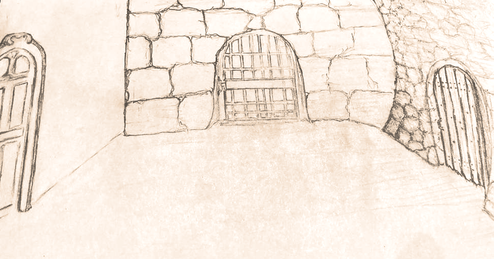
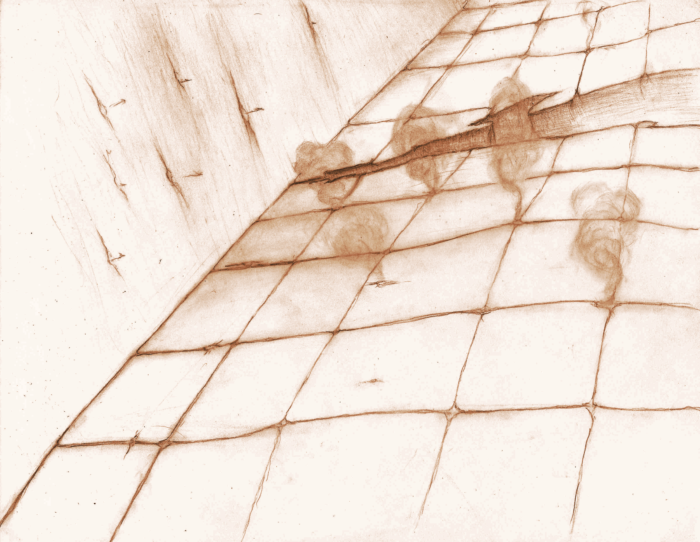
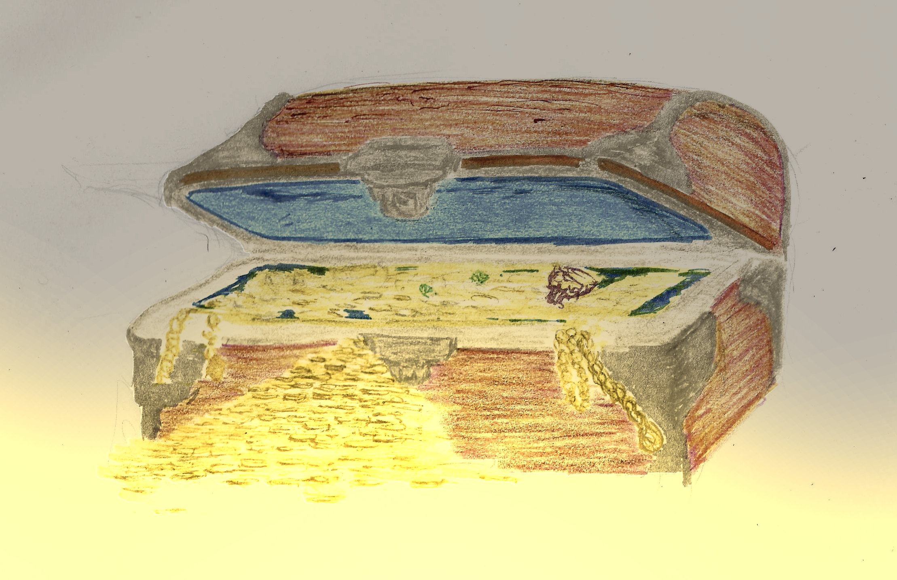
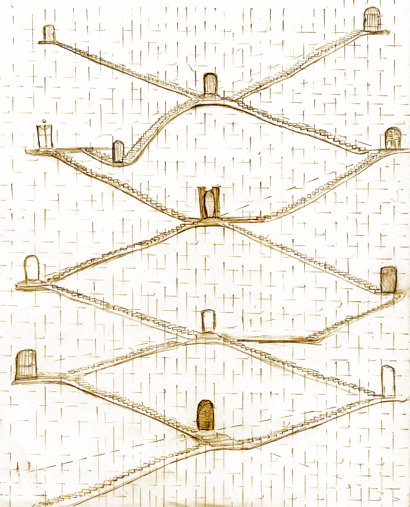

<!-- <link rel="preconnect" href="https://fonts.googleapis.com">
<link rel="preconnect" href="https://fonts.gstatic.com" crossorigin>
<link href="https://fonts.googleapis.com/css2?family=Manufacturing+Consent&family=Metamorphous&family=New+Rocker&family=Uncial+Antiqua&display=swap" rel="stylesheet">

 -->

# Navigation Charts

You'll find the information you need to make your way through the dungeon here, that is room layouts, contents and dungeon behavior.

We recommend you become somewhat familiar with the contents of this book, then return to it later to read in depth as needed.

## Table of Contents

- [Room layout](#room-layout)
  - [Room Contents](#room-contents)
    - [Room Contents Table](#room-contents-table)
- [Hazard Dice And Non Combat Events](#hazard-dice-and-non-combat-events)
  - [Non Combat Event](#non-combat-event)
  - [Hazard Die Roll](#hazard-die-roll)
    - [Hazard Dice Table](#hazard-dice-table)
    - [Expiration Table](#expiration-table)
- [Traps](#traps)
  - [Traps Table](#traps-table)
  - [Trap Deactivation](#trap-deactivation)
    - [Trap Deactivation Table](#trap-deactivation-table)
- [Finding Secret Doors](#finding-secret-doors)
- [Searching \& Secret Door Detection](#searching--secret-door-detection)
- [Locks](#locks)
- [Treasure](#treasure)
  - [Treasure  Table](#treasure-table)
  - [Regular Treasure](#regular-treasure)
    - [Regular Treasure Contents Table](#regular-treasure-contents-table)
      - [Weapons Table](#weapons-table)
      - [Armor Table](#armor-table)
      - [Scrolls Table](#scrolls-table)

  - [Stairs](#stairs)
    - [Stairs Table](#stairs-table)
    - [Reached A Normal Room](#reached-a-normal-room)
    - [Reached An Empty Room](#reached-an-empty-room)
    - [You Meet An NPC](#you-meet-an-npc)
    - [Staircase NPC Table](#staircase-npc-table)
      - [You meet a fellow adventurer](#you-meet-a-fellow-adventurer)
      - [You Meet A Friendly Ghost](#you-meet-a-friendly-ghost)
      - [You Meet A Friendly Monster](#you-meet-a-friendly-monster)
      - [You meet a merchant](#you-meet-a-merchant)
    - [Reached A Decadent Holy Shrine](#reached-a-decadent-holy-shrine)
    - [Reached A Vibrant Holy Shrine](#reached-a-vibrant-holy-shrine)

## Room layout

<figure>
  

  <i>
<figcaption>Room sizes vary, but they can be considered of sufficient size for most tactical enterprises from area effects to skirmishes to navigation within a short span of time.</figcaption>
</i>
</figure>

For simplicity, rooms are described from the perspective of the entrance. An exit towards the front is considered "Door 1" or more concisely D1 (regardless of whether there is a door or just an open cave). To the left, is D2 and to the right is D3. Some exits can be seen in plain sight but some are hidden, these are depicted as Secret or S (S1, S2 or S3).

Roll a d6 to discover the room layout:

1. All doors open
~~~
***D1***
*      *
D2    D3
*      *
***EN***
~~~
2. D2 & D3 open
~~~
********
*      *
D2    D3
*      *
***EN***
~~~

3. D1 open, S2 is a secret door
~~~
***D1***
*      *
S2     *
*      *
***EN***
~~~
4. D1 open, S3 is a secret door
~~~
***D1***
*      *
*     S3
*      *
***EN***
~~~
5. S1 is a secret door, D3 is open
~~~
***S1***
*      *
*     D3
*      *
***EN***
~~~
6. S1 is a secret door, D2 is open
~~~
***S1***
*      *
D2     *
*      *
***EN***
~~~

Open doors can be traversed normally upon discovery; secret doors must be found before using, see *searching & secret door detection* below.

### Room Contents

Once you determined the layout of the room, roll a d6 in the room contents table to determine what is actually in the room:

#### Room Contents Table

|       **Roll**       |                                    **Room Contents**                                      |
| -------------------- | ----------------------------------------------------------------------------------------- |
| 
 1 
 |  You found [a Trap](#traps).                                                              |
| 
 2 
 |  You face an Encounter, *see Monster Almanac*.                                            |
| 
 3 
 |  Quest encounter or encounter if none, *see Quest Catalog or Monster Almanac if none*     |
| 
 4 
 |  You find a [Treasure](#treasure).                                                        |
| 
 5 
 |  Quest event, *see Quest Catalog*.                                                        |
| 
 6 
 |  The room contains [a Flight of Stairs](#stairs).                                         |

## Hazard Dice And Non Combat Events

Hazard dice depict the dangerous nature of the dungeon, thrown after 4 non combat events.

### Non Combat Event

Represent a sizable lapse of time spent out combat in a dungeon. Non Combat events are:

- Revisiting a room
- Searching
- Picking a lock

Whenever a trap is sprung, a combat initiated or a hazard die is thrown, the non combat event count goes back to 0.

### Hazard Die Roll

Hazard Die Rolls depict events that take you by surprise when things seemed otherwise peaceful in the dungeon.

#### Hazard Dice Table

|       **Roll**       |                **Hazard**                |
| -------------------- | ---------------------------------------- |
| 
 1 
 | Quest Encounter                          |
| 
 2 
 | Encounter                                |
| 
 3 
 | [Trap](#traps)                           |
| 
 4 
 | Fatigue                                  |
| 
 5 
 | [Expiration](#expiration-table)          |
| 
 6 
 | No event                                 |

#### Expiration Table

An item in your possession expired, roll expiration table below to find out which:

|       **Roll**       |  **Item Expired**   |
| -------------------- | ------------------- |
| 
 1 
 | Rations             |
| 
 2 
 | Torch               |
| 
 3 
 | Cure Potion         |
| 
 4 
 | Antidote Potion     |
| 
 5 
 | Medicinal Potion    |
| 
 6 
 | Bandage set         |

If the character doesn't own that item, then ignore the expiration. Otherwise, request that this item is moved to another slot to attempt to purify it later. Refusing causes other items in that slot to expire, though the player can choose to discard it instead. Torches are an exception, an expired torch is discarded automatically.

## Traps

<figure>
  

  <i>
<figcaption>Traps can be sprung at any time for every reason. One can't lower their guard within the dungeon.</figcaption>
</i>
</figure>

You'll find many perilous traps underground.

### Traps Table

Roll a *d6* to determine which trap you ran into:

|       **Roll**       |     **Trap**      |                                                 **Description**                                              |
| -------------------- | --------------------- | ------------------------------------------------------------------------------------------------------------ |
| 
 1 
 | *Pit Trap*            | A pit opens below you, roll a *dex save* to avoid the trap or receive *(dungeon_level)+d6* HP damage also your character is *sprained*. |
| 
 2 
 |  *Poison Darts*       | Poison darts shoot out of the walls, roll a *dex save* or be *poisoned*.                                     |
| 
 3 
 |  *Toungues of Flame*  | You hear a click and tongues of flames shoot out in your direction, roll a *dex save* or receive *(dungeon_level+1)d6* HP damage and loose one of your torches. |
| 
 4 
 |  *Spikes*             | A weighted plate is pressed and spikes shoot forth, roll a *dex save* or receive *(dungeon_level)d6+(dungeon_level)* HP damage. |
| 
 5 
 |  *Toxic Gas*          | Noxious gas floods the room, roll a *body save* or take *(dungeon_level+1)* HP damage and become *diseased*. |
| 
 6 
 |  *Lightning Rune*     | You hear a hum then lightning is unleashed, roll a *magic save* or take *(dungeon_level)d6+2* HP damage.     |

### Trap Deactivation

In **The Hunt For The Treasure Of Aural Hall**, the *player who entered the room or rolled hazard die* has a chance to deactivate the trap so long as it has a set of thief's tools in its possession (it must already be in its inventory). To successfully disable a trap, you must throw a *1d6* and roll greater than *(3+dungeon_level/2)*  [see the Trap Deactivation Table](#trap-deactivation-table).

If you succeed you deactivated the trap, if you fail the trap is sprung. Failure to deactivate the trap means all characters must save against the trap to avoid its effects.

An attempt at trap deactivation will consume a set of thieves tools regardless of outcome. The character must already have the set of thief's tools in its possession, there is just not enough time to borrow the tools from another player. Rogues get a *+1* to trap deactivation rolls.

#### Trap Deactivation Table

| Dungeon Level | Trap Disable Roll |
| ------------- | ----------------- |
| 0 | 4 or greater |
| 1 | 4 or greater |
| 2 | 5 or greater |
| 3 | 5 or greater |
| 4 | 6 or greater |
| 5 | 6 or greater |

## Finding Secret Doors

To find a secret door, you must roll a magic save. Elven keen senses give them an additional advantage gaining *+2* on detection of secret doors; if the elf has no status ailments, it can ignore the *+2* and choose to roll an additional d6 instead.

## Searching & Secret Door Detection

- **Searching**: Characters detect secrets based on a die roll that must be greater than *(dungeon_level+1)*. Elves get a re-roll when detecting secrets, while Rogues have a *+1* to their role.

Searching is performed when attempting to Detect a Secret Doors. This is done in a similar manner to disabling a trap, a player must roll a d6 roll greater than *(dungeon_level+1)* with 1 always being failure and 6 always being a success. Elves and Rogues gain a *+1* to search; these two bonuses are cumulative (an Elf Rogue gets a *+2*).

The process of searching is slow and counts as traversing a room for the purposes of hazard dice rolls.

## Locks

To pick a lock a player must roll a d6 roll greater than *(dungeon_level+1)* with 1 always being failure and 6 always being a success. Rogues and Brownies gain a *+1* to lock picking rolls. A Brownie Rogue gets a *+2* to lock picking rolls.

The process of picking a lock counts takes time and counts as traversing a room for the purposes of hazard dice rolls.

Also Picking a lock consumes a lock-pickers kit.

## Treasure

Fortune favors the bold. Adventurers will find something in those chests that more or less matches what they need.

<figure>
  

  <i>
<figcaption>Seems you found a treasure chest, this is a joyous occasion... Or is it?</figcaption>
</i>
</figure>

However things are not always what they seem when finding treasure  you must roll to see what kind of treasure  you found. Then, depending on the contents, refer to the proper table:

### Treasure  Table

|       **Roll**       | **Treasure**   |                                                 **Description**                                                        |
| -------------------- | -------------- | ---------------------------------------------------------------------------------------------------------------------- |
| 
 1 
 |  *Trapped*     | [You found a trapped regular treasure. Disable the trap first](#traps), [then view its contents](#regular-treasure).   |
| 
 2 
 |  *Mimic*       | Surprise attack. If in ground level (*dungeon_level* is 0), this is a [regular treasure](#treasure).                   |
| 
 3 
 |  *Locked*      | Must expend a thieves toolkit to open, roll a dex save if failed the mechanism is jammed - This is a [regular treasure](#regular-treasure). |
| 
 4 
 |  *Locked*      | Must expend a thieves toolkit to open, roll a dex save if failed the mechanism is jammed - This is a [regular treasure](#regular-treasure). |
| 
 5 
 |  *Regular treasure*   | You find a [regular treasure](#regular-treasure).                                                               |
| 
 6 
 |  *Regular treasure*   | You find a [regular treasure](#regular-treasure).                                                               |

### Regular Treasure

You found an unlocked and unguarded treasure, roll the regular treasure  contents table to find out what's inside:

#### Regular Treasure Contents Table

Roll a d6 to discover the treasure's contents:

|       **Roll**       | **Contents**       | **Description**                                                                    |
| -------------------- | ------------------ | ---------------------------------------------------------------------------------- |
| 
 1 
 |  *Weapon*          | You found a weapon, see [weapons table](#weapons-table).                           |
| 
 2 
 |  *Gold*            | *100\*(1+dungeon_level)d6* g.                                                      |
| 
 3 
 |  *Rations*         | There are *3\*(1+dungeon_level)* of them; however you must roll a *d6* equal to or greater to the level where they were found or these are spoiled and must be purified before consuming.                                                           |
| 
 4 
 |  *Adventure gear*  | *(dungeon_level)* torches, thief's tools and fire oil (can be distributed between party members).                                                                                                                        |
| 
 5 
 |  *Armor*           | You found a piece of armor, [see armor table](#armor-table).                       |
| 
 6 
 |  *Spell scroll*    | You found a magic scroll, [see scroll table](#scrolls-table).                      |

*Tables for each category of item you can find in the table above are outlined below, roll a d6 to see which item you found.*

##### Weapons Table

Roll a d6 to see which weapon you found inside the treasure:

|       **Roll**       | **Contents**                     |                                 **Description**                                              |
| -------------------- |  --------------------------------| -------------------------------------------------------------------------------------------- |
| 
 1 
 |  *Arrows*                        | You find *10\*(1+dungeon_level)* arrows and *10\*(dungeon_level+1)* g.                       |
| 
 2 
 |  *Bow and Arrows*                | You find 10 arrows and a +*(dungeon_level)/2* bow, worth *50\*(dungeon_level+1)* g.          |
| 
 3 
 |  *One Handed Weapon*             | You find a *+(dungeon_level)/2* One Handed Weapon worth *100\*(dungeon_level)* g.            |
| 
 4 
 |  *One Handed Weapon*             | You find a *+(dungeon_level)/2* One Handed Weapon worth *100\*(dungeon_level)* g.            |
| 
 5 
 |  *Two Handed Weapon*             | You find a *+(dungeon_level)/2* Two Handed Weapon worth *150\*(dungeon_level)* g.            |
| 
 6 
 |  *Ranged Weapon*                 | You find a *+(dungeon_level)/2* Ranged Weapon worth *150\*(dungeon_level)*g and *300\*(dungeon_level)* g. |

*As can be seen, level 0 weapons are not worth anything, but as can be seen they will become valuable later on.*

##### Armor Table

Roll a d6 to see which piece or armor you found inside the treasure:

|       **Roll**       | **Contents**   |                                           **Description**                                                 |
| -------------------- | -------------- | --------------------------------------------------------------------------------------------------------- |
| 
 1 
 |  *Shield*      | You find a +*(dungeon_level)/2* Shield, worth *30\*(dungeon_level)* g.                                    |
| 
 2 
 |  *Shield*      | You find a +*(dungeon_level)/2* Shield, worth *30\*(dungeon_level)* g.                                    |
| 
 3 
 |  *Helmet*      | You find a +*(dungeon_level)/2* Helmet, worth *60\*(dungeon_level)* g.                                    |
| 
 4 
 |  *Bringandine* | You find a +*(dungeon_level)/2* Brigandine, worth *50\*(dungeon_level)* g.                                |
| 
 5 
 |  *Chainmail*   | You find a +*(dungeon_level)/2* Chainmail, worth *100\*(dungeon_level)* g.                                |
| 
 6 
 |  *Platemail*   | You find a +*(dungeon_level)/2* Platemail, worth *200\*(dungeon_level)* g.                                |

##### Scrolls Table

Roll a d6 to see which magic scroll you found inside the treasure:

|       **Roll**       |  **Contents**   |
| -------------------- | --------------- |
| 
 1 
 | *Illuminate*    |
| 
 2 
 | *Invisibility*  |
| 
 3 
 | *Protection*    |
| 
 4 
 | *Invigorate*    |
| 
 5 
 | *Stop*          |
| 
 6 
 | *Fireball*      |

*Each of these scrolls can be consumed or learned upon reaching the surface.*

### Stairs

You reached a flight of stairs, however upon descending you may find any sort of passages. Regardless, once you exit, you reach a lower level.

<figure>
  

  <i>
<figcaption>This party has run into a massive hub of staircases. Most flights of stairs lead straight down, but it's impossible to anticipate a staircase layout.</figcaption>
</i>
</figure>

Once the stairs have been found you instinctively go down (you can choose to go back up the next turn, but first you descend). Then roll a d6:

*Note that traversing a flight of stairs counts as traversing a room for the purposes of hazard dice rolls. Though this comes into effect after reaching your destination.*

#### Stairs Table

|       **Roll**       |                                                  **Contents**                                                         |
| -------------------- | --------------------------------------------------------------------------------------------------------------------- |
| 
 1 
 | You reach a normal room, [roll for room layout](#room-layout) then [roll for room contents](#room-contents).          |
| 
 2 
 | You reach a normal room, [roll for room layout](#room-layout) then [roll for room contents](#room-contents).          |
| 
 3 
 | You reach an empty room, [roll for room layout](#room-layout).                                                        |
| 
 4 
 | You meet someone on the stairs, [roll for NPC](#you-meet-an-npc).                                                     |
| 
 5 
 | You reach a deteriorated shrine, [roll for decadent holy shrine](#reached-a-decadent-holy-shrine).                    |
| 
 6 
 | You reach a well maintained shrine, [roll for vibrant holy shrine](#reached-a-vibrant-holy-shrine).                   |

*As soon as you enter a new room you should begin charting your map on a different page or a distant part of the page if you have space. Make sure to mark this initial room as the exit to the surface, see: **making your way back**.*

#### Reached A Normal Room

Roll the room Contents Table, keeping in mind you are now one level deeper. Don't forget to notate the staircase in this room.

#### Reached An Empty Room

If you reach an empty room, you made it one level below. There are no monsters here but it's not a safe place to stay for long so you should continue exploring. Don't forget to make a note of the staircase in this room.

#### You Meet An NPC

Well what do you know? It's a small dungeon after all.

#### Staircase NPC Table

|       **Roll**       |                         **Item Expired**                       |
| -------------------- | -------------------------------------------------------------- |
| 
 1 
 | You [meet a fellow adventurer](#you-meet-a-fellow-adventurer). |
| 
 2 
 | You [meet a merchant](#you-meet-a-merchant).                   |
| 
 3 
 | You [meet a friendly ghost](#you-meet-a-friendly-ghost).       |
| 
 4 
 | You [meet a merchant](#you-meet-a-merchant).                   |
| 
 5 
 | You [meet a friendly monster](#you-meet-a-friendly-monster).   |
| 
 6 
 | You [meet a merchant](#you-meet-a-merchant).                   |

##### You meet a fellow adventurer

In front is a somewhat solemn and battle hardened adventurer. The fact that this is a single person tells you all you need to know.

If your next quest objective requires that you talk to someone or find a clue, the adventurer will be willing to help (consider it solved).

If you lack food provisions, the adventurer will exchange 3 torches for a single day's worth of rations.

Otherwise, you exchange a look of acknowledgment and move on and reach an empty room, see above.

##### You Meet A Friendly Ghost

Friendly undead steer clear of Paladins, if you have a Paladin in your party you will instead simply reach a normal room. Otherwise, keep reading...

In front is a translucent figure, you don't feel malice or evil intent coming from it - perhaps, it's a fallen comrade.

If your next quest objective requires that you talk to someone or find a clue, the ghost will be willing to help but you'll have to roll a save against magic to understand what it's saying.

Otherwise, you move on and reach an empty room, see above.

##### You Meet A Friendly Monster

In front is a menacing figure, but you don't feel malice or evil intent coming from it. However if you have a Paladin on your party, roll against (1+dungeon_level), if you fail the monster decides to ignore you, instead you will simply reach a normal room. Otherwise, keep reading...

If your next quest objective requires that you talk to someone or find a clue, the monster will be willing to help but you'll have to roll a save against body to understand what it's saying (body-talk).

Otherwise, you move on and reach an empty room, see above.

##### You meet a merchant

You meet a humanoid carrying a large backpack, at first it utters something monstrous then coughs a bit and communicates flawlessly in you language:

> Greetings! It's a pleasure to meet such fine people in these depths, and I'm fortunate to have an assortment of goods at your disposal...

The merchant puts the backpack on the floor and soon has an improptu shop all laid out neatly (it's evident there's a lot of practice behind this).

The wares sold are the same as the surface but at twice the price. Still, the travel expenses are to be expected, oh and the pay for your items is exactly the same as the surface ... now why isn't this double?

Once you made your shopping you wave goodbye and move. You reach reach an empty room, see above.

#### Reached A Decadent Holy Shrine

This shrine has seen better days. It can protect you while you rest, but it can only do so once. Do you want to do it now or on your way back? If you do, you consume one of your rations.

Regardless you will exit to an empty room. If you choose to wait, be sure to make a note of the shrine as well as the stairs on that room.

#### Reached A Vibrant Holy Shrine

You are a lucky traveller. You can rest freely here, and it will be waiting for you to rest as many times as needed. Just keep in mind, that it will not provide you with rations (you consume rations each time you rest, or get no benefits from it) and you should be fine. Naturally, this leads to an empty room below, be sure to make a note of the vibrant shrine as well as the stairs on that room.
