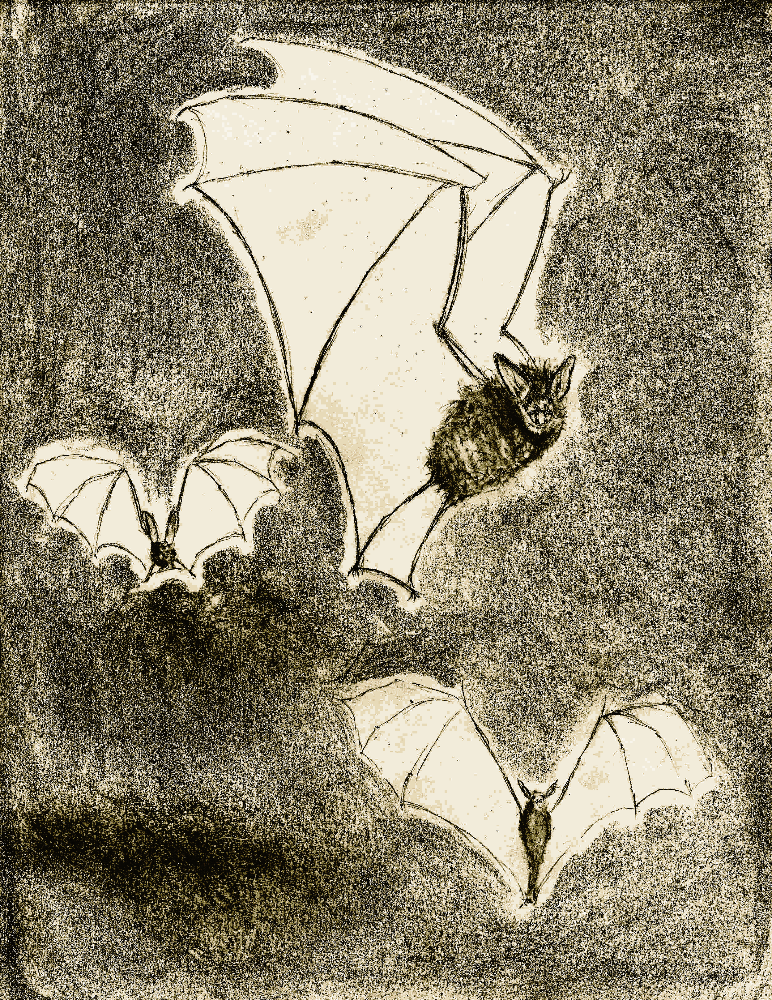
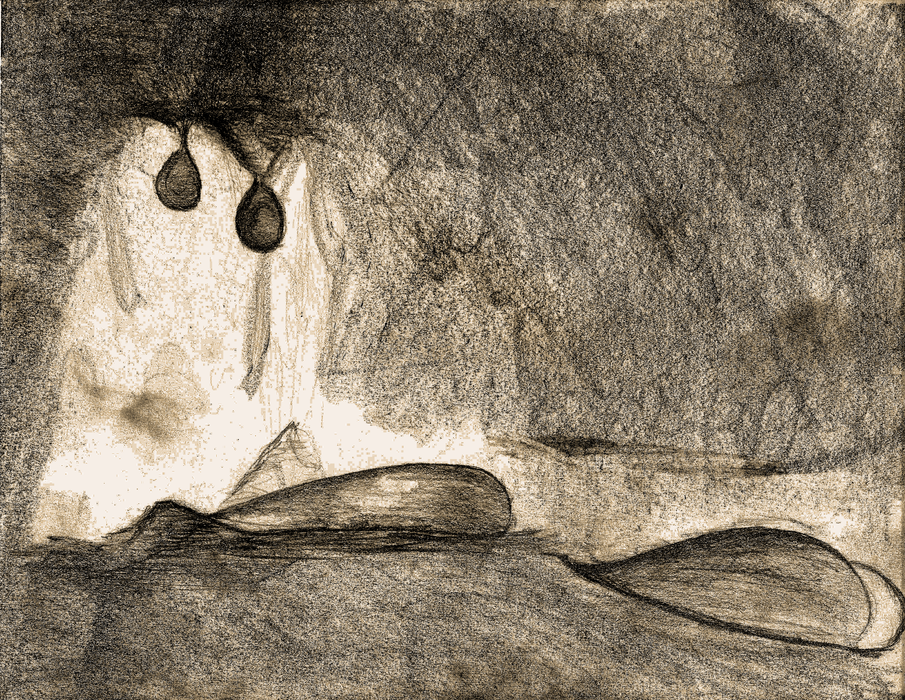
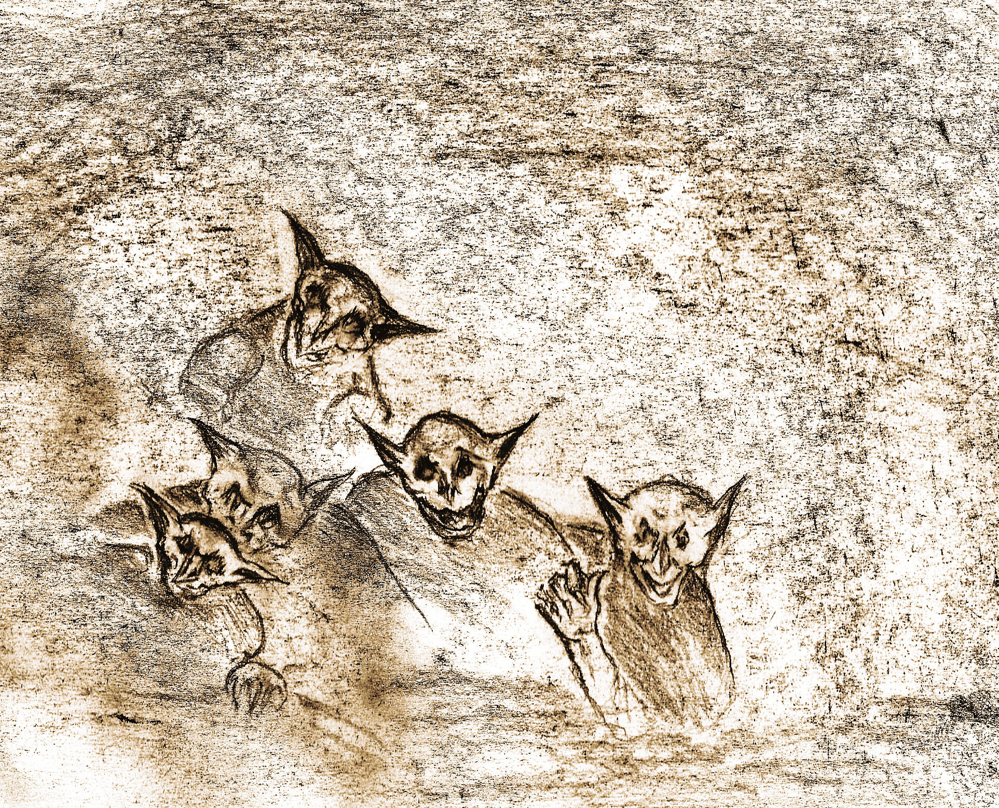
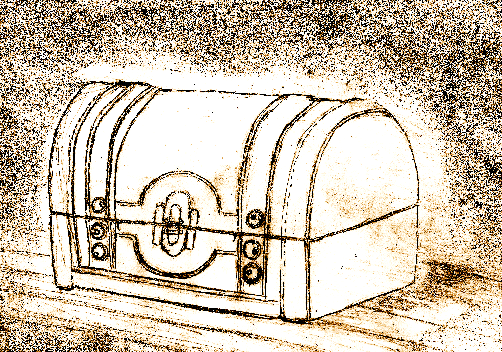
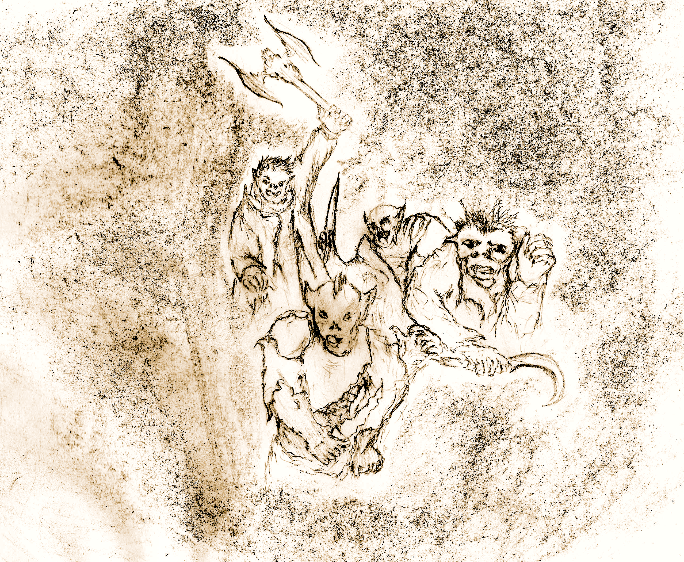
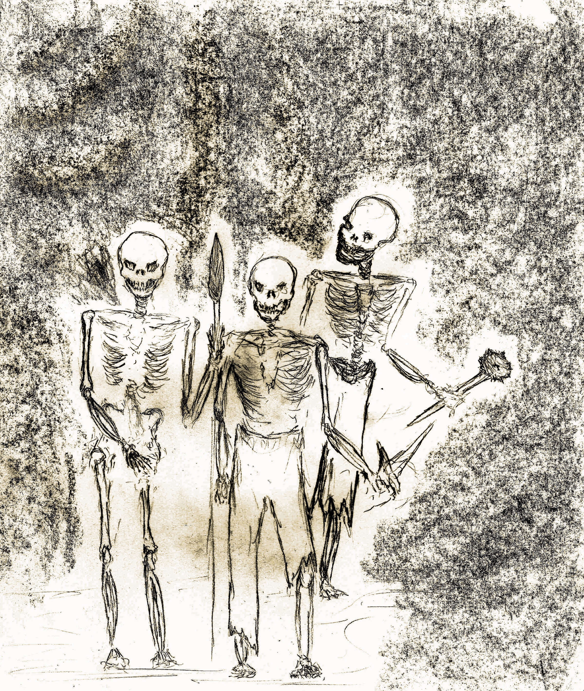
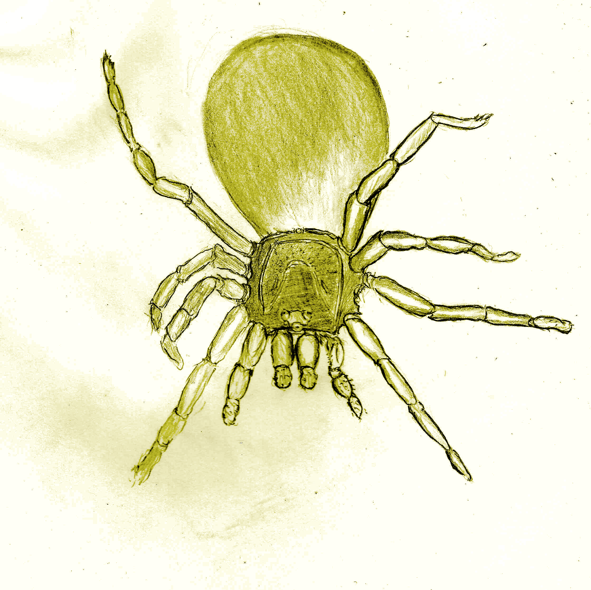
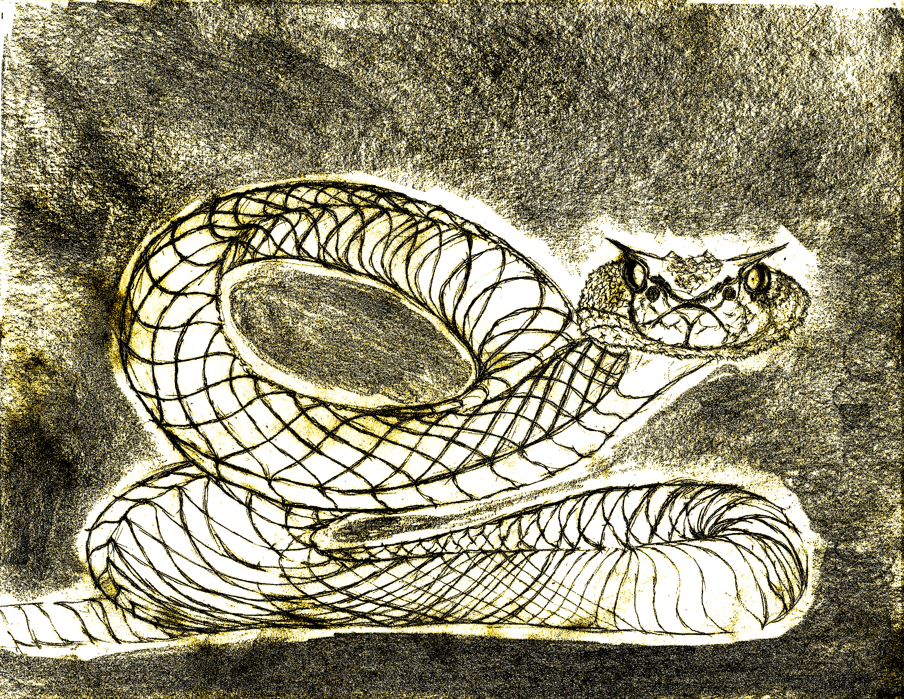

<!-- <link rel="preconnect" href="https://fonts.googleapis.com">
<link rel="preconnect" href="https://fonts.gstatic.com" crossorigin>
<link href="https://fonts.googleapis.com/css2?family=Manufacturing+Consent&family=Metamorphous&family=New+Rocker&family=Uncial+Antiqua&display=swap" rel="stylesheet">

 -->

# Monster Almanac

These are the official **DepthRangers** guild monster records. This tome describes "most" of the beasts encountered during travels in the dungeons... There are rumors, of certain beasts that have not been charted, so keep that in mind, and consider submitting any such discoveries so they can be added to the official records.

*Such monsters will only be found in the corresponding quest*.

## Table of Contents

* [Calculating Monster Stats](#calculating-monster-stats)
* [Encounters](#encounters)
  * [Encounters per level](#encounters-per-level)
    * [Level 0 Encounters Table](#level-0-encounters-table)
    * [Level 1 Encounters Table](#level-1-encounters-table)
* [Monsters](#monsters)
  * [Bat](#bat)
  * [Black Ooze](#black-ooze)
  * [Goblin](#goblin)
  * [Lesser Vampire](#lesser-vampire)
  * [Mimic](#mimic)
  * [Orc](#orc)
  * [Skeleton](#skeleton)
  * [Spider](#spider)
  * [Snake](#snake)
* [Retreating From An Encounter](#retreating-from-an-encounter)
* [Enemy Reactions](#enemy-reactions)

## Calculating Monster Stats

Monster become more powerful the deeper you go into the dungeon. As a general principle, their HP is related to their level:

*
Monster HP = (dungeon_level+1)d6
*

And the monster damage uses the same formula:

*
Monster Damage = (dungeon_level+1)d6
*

But, there are many exceptions, please read the monster's detailed descriptions to see if the principle laid out applies.

## Encounters

There are many perils to face when in the depths of the dungeon. Worse yet is that the dungeon itself becomes more perilous the deeper you descend. The monsters you already knew will become more powerful, adding an HP/damage dice for each level.

This makes surface dwelling monsters very deadly when found deeper. However, there are some monsters who never show themselves on the surface and can only be met once you have descended sufficiently. And those will be even deadlier.

Keep in mind that some enemies may react non-violently, be sure to check if the monster is potentially peaceful and if so look at the reactions table at the end of this document.

### Encounters per level

The tables below list the d6 monster encounters found at each level:

#### Level 0 Encounters Table

1. [Orc](#centerorccenter)*
2. [Snake](#centersnakecenter)+
3. [Goblin](#centergoblincenter)*
4. [Skeleton](#centerskeletoncenter)
5. [Spider](#centerspidercenter)+
6. [Bat](#centerbatcenter)+

#### Level 1 Encounters Table

1. [Black Ooze](#centerblack-oozecenter)
2. [Orc](#centerorccenter)*
3. [Snake](#centersnakecenter)+
4. [Goblin](#centergoblincenter)*
5. [Skeleton](#centerskeletoncenter)
6. [Spider](#centerspidercenter)+

*We are currently play-testing the rest of the journey, so unfortunately for now this is as deep as you should descend. However, should you descend further (into a level that's not currently covered), use monsters from the last charted level (for now).*

## Monsters

As mentioned before, there are many denizens in the depths however record keeping is not an easy task when you're in the heat of battle. Even afterwards, horror, fatigue or death seem to get in the way of proper recollection of the minutia of these dangerous beings. That said, here is a list of a few well known dwellers of the depths.

### 
Bat

<figure>
  

  <i>
<figcaption>These vicious flying mammals are not to be underestimated.</figcaption>
</i>
</figure>

You find *(party_size+dungeon_level)* large blood sucking bats, each has *(1+dungeon_level)* HP. Bats perform a *(dungeon_level)+d6* damage, on any roll of *1* they use screech instead of missing. On critical hits they cause a *hemorrhaging byte*. They have an accuracy equivalent to a character using single-handed weapon (remember to add *+1* to the monster level when calculating accuracy).

**Hemorrhaging Byte:** The bat falls on top of the player and sinks its fangs, causing additional *dungeon_level* HP damage leaving an open wound behind. The character is afflicted by bleeding.

**Screech:** Each party member must save vs body or receive *(dungeon_level+2)* HP damage.

Brownies can talk to bats, when persuadable pay a single ration for all bats.

### 
Black Ooze

<figure>
  

  <i>
<figcaption>Black Oozes pose an unsurmountable challenge for ill-prepared explorers.</figcaption>
</i>
</figure>

Black Oozes come in pairs and have *(dungeon_level+1)d6* HP and inflict the same amount of damage. They are immune to sneak attacks, sedation and all spells, and must be attacked by ranged weapons or they will split into *2* Black Oozes. They have an accuracy equivalent to a character using single weapon (remember to add *+1* to the monster level).

### 
Goblin

<figure>
  

  <i>
<figcaption>You encounter a party of goblins, their malice is something you can never get used to.</figcaption>
</i>
</figure>

Goblins have *1d6* HP, but they attack in packs of *(dungeon_level+party_size)*. They have an accuracy equivalent to a character using single weapon (remember to add *+1* to the monster level).

**Lightly Armored:** Goblins have *(dungeon_level+1)/2* AC, meaning they have some armor from level 1 onwards.

**Strength In Numbers:** Goblins inflict *1d6* damage when on their own. However when within the proximity of an another Goblin (there's more than one Goblin left) they instead inflict *(dungeon_level+number_of_goblins+1)+1d6* HP damage.

**Underhanded Tactics:** When there's than more than one Goblin adversary, upon landing a critical hit, another Goblin in its party is incentivized to take advantage of the distraction and attack the character with the least HP. This attack can potentially trigger an indefinite number of additional *Underhanded Tactics* attacks on consecutive critical attacks.

**Rejection Of Fairness:** When the number of goblins left is lower than your party size, a Goblin will escape on a missed attack.

Roll a reaction dice when encountering goblins, when uncertain pay *(dungeon_level+1)\*100*g to bribe them.

### 
Lesser Vampire

<!-- TODO This monster is missing an image -->

A lesser vampire is a recently transformed human, they are still weaker than their longer lived brethren (fortunately). However, they still possess many deadly abilities that can put any party in danger.

A lesser vampire has *2\*(dungeon_level+1)d6* HP, and is immune to sedation and sneak attacks.

**Lasting Injuries**: When attacked by a lesser vampire, roll a body save or lose *1* HP per round for *(dungeon_level+1)* rounds.

**Mesmerized**: You are unable to attack the vampire who's mesmerizing you (you can attack any other enemy though, including other vampires). This is a form of mental compulsion.

**Compulsion Desperation**: Additionally, when the vampire is critically wounded, each member of the party must roll a magic save or be mesmerized (only triggers once). On failure, roll a magic save each round until you succeed. After succeeding however, you must wait one more round before your head is clear enough to resume attacking.

**Lightly Armored:** Lesser Vampires have a strong resistance against damage granting them an equivalent to *(dungeon_level+1)/2* AC.

### 
Mimic

<figure>
  

  <i>
<figcaption>Mimics are the dungeons prime opportunists, laying in wait for their next meal.</figcaption>
</i>
</figure>

Mimics hide waiting to catch unwary prey and posing as a treasure makes for a compelling lure. When confronted by a mimic the character that discovered it must roll a dex save, if failed the mimic latches onto the player and performs a barrage of successful attacks inflicting *(maximum damage)* each turn. They have an accuracy equivalent to a character using single weapon (remember to add *+1* to the monster level).

When a mimic has already latched, the player must now roll a body save (raw strength) to escape. Mimics can only latch on to one player at a time, should the discoverer escape, then their main target is whomever is weakest. They have *2\*(dungeon_level+party_size/3)d6* HP.

**Opportune Getaway**: Should they kill an adventurer, they will escape with the body making it impossible to revive the fallen character.

**Self Preservation**: When a mimic's life is reduced to *(dungeon_level+1)* HP it will immediately escape.

### 
Orc

<figure>
  

  <i>
<figcaption>Orc Hunters appear before you. Their ferocity is unquestionable.</figcaption>
</i>
</figure>

Orcs attack in small hunting parties of size *(party_size)/2+1*, and have *(dungeon_level+1)d6* HP inflicting the same amount of damage. They have an accuracy equivalent to a character using a two handed weapon (remember to add *+1* to the monster level).

**Armored:** Orcs have *(dungeon_level+1)* AC.

**Bloodlust:** Upon performing a critical attack, the target must perform a body save or suffer from bleeding. Additionally, the thrill will propel an Orc to perform a second attack against the same or another target. Each attack has a chance at activating an indefinitely long chain of bloodlust attacks.

**Payback:** Upon receiving a critical attack, the enraged Orc will strike the opponent back, potentially triggering bloodlust when landing a critical attack to the attacker.

**Last Stand:** When an Orc only has *(dungeon_level+1)* HP left or is the last Orc left alive, it can crit on attacks that use *4s* as well as *5s* and *6s*.

Roll a reaction dice when encountering orcs, when persuadable pay *(dungeon_level+1)* rations plus *(dungeon_level+1)\*100g*.

### 
Skeleton

<figure>
  

  <i>
<figcaption>The clicking of bones seems to have an unnerving regularity as the skeletons march in your direction.</figcaption>
</i>
</figure>

Skeletons are undead monsters that come in *(party_size)* quantities, and have *(dungeon_level+1)d6* HP and inflict the same damage. Skeletons are immune to ranged weapons (though they sound musical when struck), sedation and sneak attacks. They have an accuracy equivalent to a character using single weapon (remember to add *+1* to the monster level).

**Reanimate:** When a skeleton is defeated, it must be attacked again the next round or it will recover half its HP total. If not completely destroyed, they can reanimate an indefinite amount of times.

**Undead:** Skeletons are undead creatures.

### 
Spider

<figure>
  

  <i>
<figcaption>A venomous spider dangles from the ceiling landing right in front of you, then another to the side, then more. These spiders have you surrounded!</figcaption>
</i>
</figure>

You are attacked by *(party_size+dungeon_level+2)* spiders, they have *(dungeon_level+1)* HP and inflict the same damage. Spiders are venomous, when attacked make a successful Body save or you will be poisoned. They have an accuracy equivalent to a character using single weapon (remember to add *+1* to the monster level).

Brownies can talk to spiders, when persuadable pay a single ration for all spiders.

### 
Snake

<figure>
  

  <i>
<figcaption>The mesmerizing patterns on the contour of the massive snake before you challenge your hold on reality.</figcaption>
</i>
</figure>

You are attacked by a large snake. It has *(party_size+dungeon_level+1)d6* HP, and inflicts *(dungeon_level+1)d6* damage. These slithering reptiles are not venomous, yet they are still quite lethal.

When a snake performs a [critical attack](#critical-attack), the target must make a successful magic save or it will become *hypnotized* for *(dungeon_level+1)* rounds. If the attack is not critical but is any combination of *(dungeon_level+1)/2* *5s* and *6s* it will perform a *whiplash attack* instead.

Snakes have an accuracy equivalent to a character using single-handed weapon (remember to add *+1* to the monster level).

**Hypnotized:** When a target is hypnotized by a snake, the target will become motionless (unable to attack, defend or assist in any way). A successful Magic save ends this condition early. If the target successfully saves vs hypnotism the angered snake still delivers critical attack damage. Otherwise, the target is unharmed that round.

**Whiplash Attack:** The snake coils itself then unleashes a punishing blow, the target must perform a successful body save or will be sprained.

Brownies can talk to snakes, when persuadable pay *(dungeon_level+1)\*2* rations.

## Retreating From An Encounter

What are you a humanoid or a Humanoid Rat? No retreating, you succeed or die trying!

## Enemy Reactions

Monsters  may react in a non-hostile manner (or not); some monsters will only react if there's a Brownie in the party. Throwing a reaction die provides 3 outcomes:

| **Roll** | **Reaction**  | **Description**                                                           |
| -------- | ------------- | ------------------------------------------------------------------------- |
|   1-2    |  *Hostile*    | You engage in combat                                                      |
|   3-4    | *Persuadable* | Pay *(monster_level+1)d6* gold and be left alone, pay twice that amount and gain clues if that is a quest event for you. If  you don't have the money to be left alone they will pretend to be friendly and engage when you least expect it. Characters with the **reconnaissance** attribute get to roll as if it were a *Quest Encounter*. Otherwise, monsters get to attack first. |
|   5-6    |   *Friendly*  | Monsters will not attack and can offer clues if your quest requires them. |
