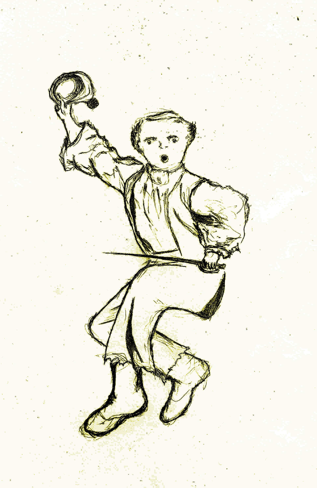
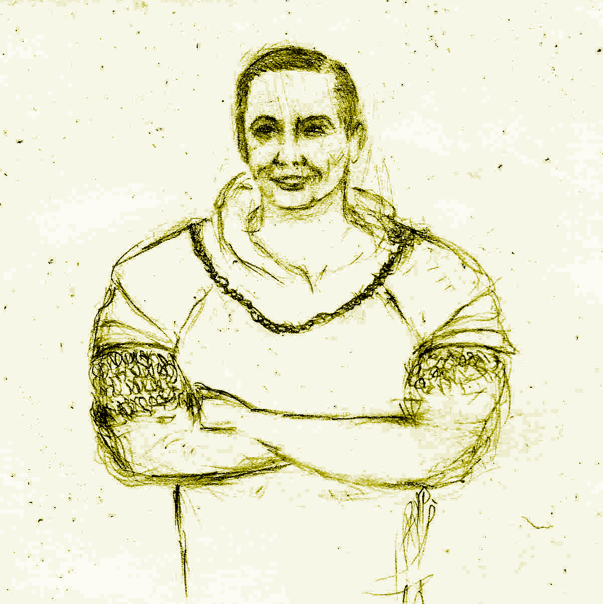
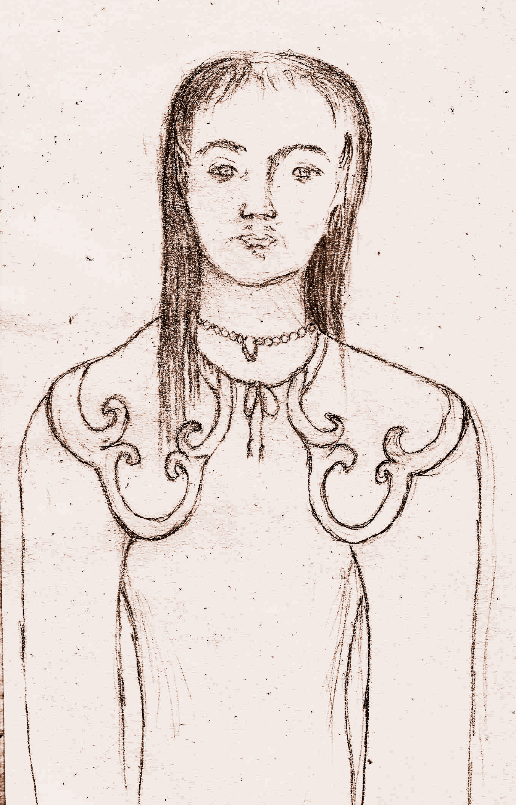
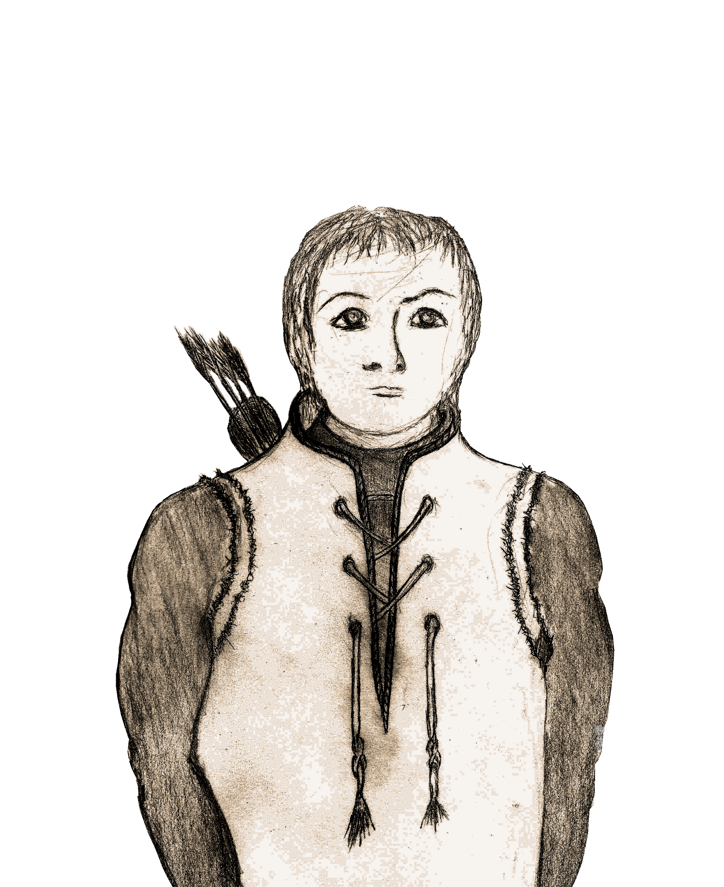
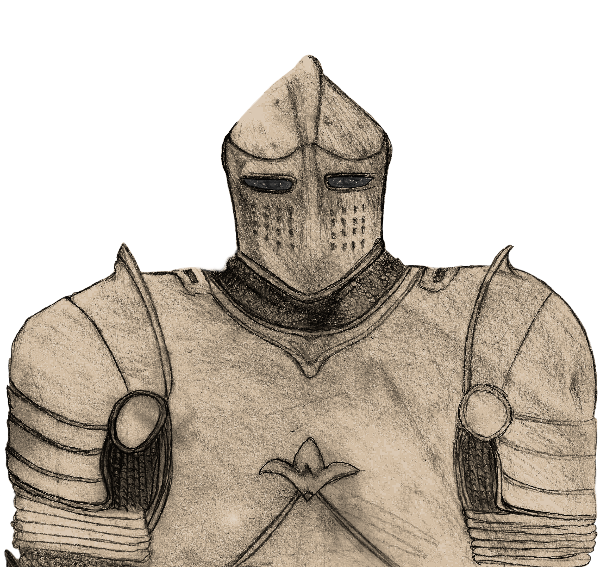
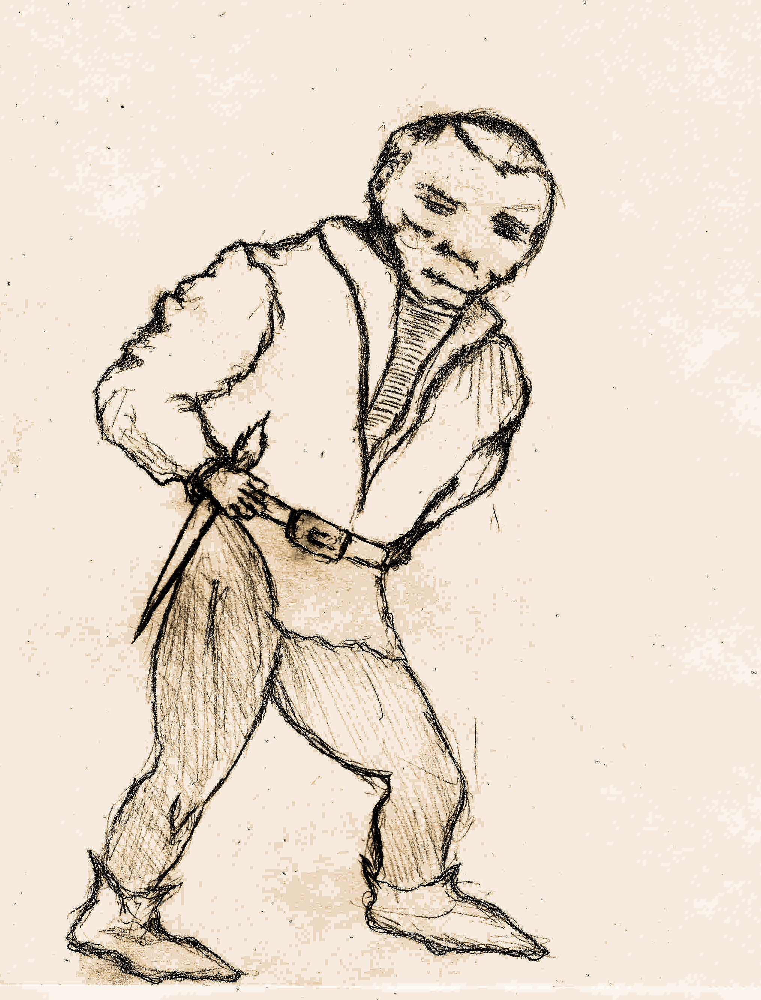

<!-- <link rel="preconnect" href="https://fonts.googleapis.com">
<link rel="preconnect" href="https://fonts.gstatic.com" crossorigin>
<link href="https://fonts.googleapis.com/css2?family=Manufacturing+Consent&family=Metamorphous&family=New+Rocker&family=Uncial+Antiqua&display=swap" rel="stylesheet">

 -->

# Character Creation Guide

This reference guide provides an explanation on how to create your characters without need for the provided character sheets.

All characters combine their species with their profession, something the great sage Gigax calls Races & Classes.

## Base stats

These generic stats are what you use when creating different characters, some [races](#races) & [classes](#classes) will require adjusting these values.

### HP

How resilient to damage your character is. The base HP for characters is *(1d6+3)* HP on their first level plus an additional *1d6* HP each level.

### Armor Class

Equipping armor is vital to surviving your adventures. You subtract the damage you receive by the total amount of armor class or "*AC*" you have. Your maximum armor is determined by the armor you can equip yourself with. Though there are some restrictions on who can use certain gear (see [races](#races) & [classes](#classes)).

### Saves

<figure>
  

  <i>
<figcaption>There are many dangers that require extraordinary maneuvers to overcome.</figcaption>
</i>
</figure>

A save is thrown when an extraordinary feat must be accomplished (such as avoiding a deadly trap).

All characters have 3 types of saves:

- **Body**: Used for resisting (fort), as well as raw physical prowess (strength).
- **Dex**: Dexterity saves are used for acrobatics, fine motor skills, sneaking and other skills that require fine control over the body or quick reaction.
- **Magic**: Magic saves are used for magical attunement when resisting or tapping into magic as well as transcendental experiences such as spiritual, will power, intellectual, etc.

*The baseline for all saves is 4.*

When asked to roll for a save a *d6* is thrown, if the value is equal to or greater than the character's save the save is successful otherwise it fails.

While saves generally require a roll of 4 or greater, some races have bonuses and penalties that will change this amount. So be sure to account for these bonuses and penalties in your character sheet.

### Money

The currency of this game is gold, and "*g*" is the unit. Your character starts out with *1d6\*20*g and will gain more gold from completing quests and selling items. You'll use this to purchase items, use services and even bribe receptive monsters into giving you information.

### Inventory

Your cargo capacity. Each character has 10 available inventory slots, so long as they don't fatigue.

### Starting Gear

You start out with 5 torches and rations.

## Races

There are 4 races of adventurers available:

- Human
- Elf
- Dwarf
- Brownie

Each has its own strengths and weaknesses and all have something valuable to contribute.

### Human

<figure>
  

  <i>
<figcaption>Ingenious and determined, humans can turn the tide of events at the last minute.</figcaption>
</i>
</figure>

Humans are set apart by their sheer willpower.

#### Human Saves

They have no bonuses or penalties.

#### Human Classes

They can be any Class.

#### Human Gear

They are limited only by their Class.

#### Human Special Feature - Manifestation Of Will Power

Human determination and sheer force of will can have a direct impact on the outcome of an adventure. It can help overcome what seem to be insurmountable odds. Human will manifests itself in the form of "*re-roll*" dice.

##### Re-Roll Dice

"*re-roll*" dice allow changing the roll of any dice, at any moment in the game, for any reason. However its influence is limited:

Expending 1 <em>re-roll</em> dice only changes the outcome of a roll of <em>1d6</em>.

For example if a save requires two dice, you can expend 1 *re-roll* dice to attempt to change either one of those two dice, but you must leave the other intact. In order to change both dice, you must expend 2 *re-roll* dice.

Humans start with a single *re-roll* dice, but gain an additional dice every two levels.

Once a *re-roll* dice dice has been expended, you can recover them in two ways:

- *resting*: recovers 1 spent *re-roll* dice.
- *leaving the dungeon*: returning to the surface recovers all spent dice.

#### Human Special Feature - Mind Over Body

Humans can expend one of their *re-roll* dice to cure any status ailment.

#### Human Special Feature - Human Perseverance

When a human character's HP goes down to *0*, and they have remaining *re-roll* dice, they can expend one re-roll dice and recover *1d6* HP to keep going. They can choose to expend additional *re-roll* dice and recover additional *d6* HP during this process of recovery.

#### Human Special Feature - Human Intuition

When a human makes a save roll of *6*, they have a *+1* to saves of that nature until the encounter or event is over.

#### Human Special Feature - Inspiring Determination

When a human lands a [critical attack](#critical-attack), for the rest of round other characters add a +1 to (character_level) die they roll.

### Elf

<figure>
  

  <i>
<figcaption>Elves have many innate advantages that could be beneficial to a party.</figcaption>
</i>
</figure>

Dextrous and magically inclined but not as resilient as humans.

#### Elf Saves

Elves have a fragile body, hence they start with *+2HP* instead of *+3HP* and gain a *+1* penalty to their *body saves* (meaning you must roll *5* or higher to succeed on a body save). However they have unusual dexterity and magical attunement, and gain a *-1* boon on *dex saves* and  also another *-1* boon on *magic saves* (meaning rolling a *3* or higher is a successful dex or magic save).

#### Elf Classes

They can be any Class.

#### Elf Gear

They are limited only by their Class.

#### Elf Special Feature - Resist Mental Manipulation

This magical affinity also makes them immune to magical compulsion and mental manipulation (such as being mesmerized or hypnotized).

#### Elf Special Feature - Keen Senses

Elven keen senses give them an edge when detecting secrets. Elves get a *+1* to search rolls.

#### Elf Special Feature - Keen Marksmanship

Elven keen senses give them an edge when wielding a ranged weapon gaining [an accuracy on par with two handed weapon wielders](#two-handed-weapons-accuracy).

### Dwarf

<figure>
  

  <i>
<figcaption>A dwarf peers into the entrance with steadfast determination.</figcaption>
</i>
</figure>

Dwarfs are hardier than their peers, but not as dexterous.

#### Dwarf Saves

Their resilient body grants them a *-2* boon to body saves (meaning that rolling a *2* or greater is considered a successful body save), but their stubby limbs impose on them a *+1* penalty to dex (meaning you must roll *5* or higher to succeed on a *dex save*).

#### Dwarf Gear

They are limited only by their Class.

#### Dwarf Classes

They can be any Class.

#### Dwarf Special Feature - Poison Immunity

They are almost entirely immune to poison, there are rumors of certain beings able to poison dwarfs but those rumors are generally dismissed.

#### Dwarf Special Feature - Dwarven Resilience

Dwarfs have *+1 HP* each level.

#### Dwarf Special Feature - See In The Dark

Dwarfs don't need to use torches to see (technically a purely dwarven party would not need torches). This can have some advantages in certain unconventional situations.

### Brownie

<figure>
  

  <i>
<figcaption>Every party can benefit from a brownie's perspective.</figcaption>
</i>
</figure>

Brownies are shorter than dwarfs and about as slender as elves.

#### Brownie Saves

Brownies are more fragile than the other races, they take *+1* penalty on *body saves* (meaning you must roll 5 or higher to succeed on a body save), but get a *-1* boon on *dex saves* (meaning rolling a 3 or higher is a successful dex save).

#### Brownie Classes

Brownies can't be healers, however they can be any other Class.

#### Brownie Gear

Brownies can't use two handed weapons, but they can use single handed weapons or ranged weapons for attack.

For armor, warriors can use Chainmail, while other classes can only use a Brigandine; but no standard shields or helmets.

#### Brownie Special Feature - Lock Picking

Brownies they are very nimble with their fingers and have a knack for locks, getting a *+1* on lock-picking throws.

#### Brownie Special Feature - Talk To Animals

Additionally they’re able to engage in conversation with animals. If you have a brownie on your party, whenever you meet an animal, it may react in a non-hostile manner. Note that any animal that is "*Persuadable*" will accept rations as a bribe instead of money (though some might ask for both).

#### Brownie Special Feature - Frail Body

Their bodies are somewhat fragile starting with *+1 HP* instead of *+3HP*, and deduct a *-1 HP* from each level up.

#### Brownie Special Feature - Hard To Hit

Given their smaller stature they are very hard to actually hit by an opponent, starting with a *+1 AC* and gaining an additional *+1 AC* per level.

##### Brownie Special Feature - Attack At A Distance

Using a bow grants them an additional *1 AC* on top of ranged weapon bonuses.

## Classes

### Fighter

<figure>
  

  <i>
<figcaption>A fighter can help keep monsters at bay.</figcaption>
</i>
</figure>

Fierce and resilient damage dealing combatants.

#### Fighter Gear

Fighters are able to equip any weapons and armors they find.

#### Fighter Boon - Enhanced Swordsmanship

When engaged in melee combat, Fighters can ignore one *d6* roll of *1* for calculating accuracy, see *attack accuracy*.

#### Fighter Boon - Deadlier Combat

When landing a successful hit, they re-roll any damage die on *1*s.

#### Fighter Boon - Attack Frenzy

Upon defeating an enemy they can strike another target that same round (two attacks on that turn).

#### Fighter Boon - Battlefield Resilience

Fighters gain an additional *+3 HP* on level 1, and an additional *+1 HP* every odd level (3, 5, etc).

#### Fighter Boon - Overwhelming Tactics

When engaged in melee combat, and landing a critical attack. If the target is a "regular sized" & "non-undead" humanoid, Fighters will overwhelm their opponent knocking them violently to the ground. The target remains stunned and inactive for one round.

### Mage

<figure>
  

  <i>
<figcaption>Mages can help turn the tide of a battle.</figcaption>
</i>
</figure>

Mages are versatile casters capable of offensive and defensive magic. They start with two spell slots and gain an additional spell per level. As Mages level up, not only do they gain more spell slots, some of the spells in their possession also become more powerful. When casting, the slot used does not matter, what matters is the Mage’s level.

While extremely versatile and powerful, Mages require preparing ahead of time. They must first assign a known spell to a slot before it can be cast. Upon resting, Mages recover all their spells and can reassign known spells to their slots.

#### Mage Gear

Mages are unable to use 2 handed weapons, and they can only equip Bringadines as armor.

#### Mage Boon - Universal Scroll & Wand Casting

Mages can use any scroll to cast a spell. However using a scroll consumes it.

Similarly, a Mage is able to use a wand if found.

#### Mage Boon - Magic Scholar

Mages can learn new spells from scrolls found in their adventures (unfortunately, the ones sold in the market are only good enough for casting not studying). They learn new spells when they bring a scroll of an unknown spell to the surface.

#### Mage Boon - Magical Attunement

Due to their mastery of magic, Mages can re-roll *magic save* die that land on one.

#### Mage Spell List

- **Invigorate**: Increases the party's melee & ranged combat output by +*character_level* for the rest of the battle.
  - Both Mages & Healers can read a scroll with this spell.
- **Protection**: Increases the party's Armor Class by +*character_level* for the rest of the battle.
  - Both Mages & Healers can read a scroll with this spell.
- **Restore Vitality**: Target recovers *(character_level)d6* HP.
  - Both Mages & Healers can read a scroll with this spell.
- **Revive**: Resurrects a fallen character to *(1d6+character_level+1)* HP.
  - Unless the party is at a rest spot, it requires a magic save to succeed.
  - Scrolls of this spell are rare, and can only be found in special chests and sold by magical/special item vendors.
  - Both Mages & Healers can read a scroll with this spell.
- **Fireball**: Launches an exploding ball of fire damaging all monsters in the room by *((1+character_level)d6)/2+character_level*.
  - Half damage on monster save, which is a roll of *(2+character_level-dungeon_level)*.
  - Only Mages can read a scroll with this spell.
- **Illuminate**: Can be used instead of torches to illuminate your surroundings.
  - Lasts for *(character_level)* dungeon levels, meaning the entire way in or the entire way out.
  - Dispels upon resting.
  - Only Mages can read a scroll with this spell.
- **Invisibility**: Target is invisible for 3 rounds, meaning they get no damage from melee or ranged enemy attacks.
  - Rogues automatically perform sneak attacks when their target is susceptible.
  - Only Mages can read a scroll with this spell.
- **Stop**: Target remains immobilized for *(character_level-dungeon_level+1)* turns.
  - Only Mages can read a scroll with this spell.

### Healer

Healers are casters focused on defensive magic. Healers start with two spell slots and gain an additional spell per level. As they level up, not only do they gain more spell slots, some spells also become more powerful (what matters is the Healer’s level not the specific slot used). Upon resting, Healers recover all their spell slots.

#### Healer Gear

Healers are able to use any armor they find, however they can't use 2 handed weapons.

#### Healer Boon - Innate Use Of Magic

Healers know all Healer spells from the start and can cast them from any slot at any given time.

#### Healer Boon - Party Focused Scroll & Wand Casting

Healers can use mage scrolls, however they can only use scrolls that target other party members.

#### Healer Boon - Improved Mending

Healers heal *(1+character_level)* HP each time they use a bandage, and gain a +*(character_level)/2* bonus when using an antidote to neutralize poison.

Additionally,from level 2 onwards healers heal an additional *+(character_level/2)d6* HP when using a Healing Potion.

#### Healer Boon - Enhanced Antibodies

Healers are immune to sickness and can't be afflicted by a diseased status.

#### Healer Boon - Potion Mixer

Healers can combine the positive attributes of two bottles into a single bottle, though they must roll a successful magic save each time.

#### Healer Boon - Expert Field Medic

Healers are the only ones who can freely use curative items on others in the middle of battle.

#### Healer Boon - Knowledge Of Anesthetics

Upon reaching level 3, a Healer has mastered sleeping potions and can use them as a localized anesthetic, relieving some of the burden of fatigue. A healer can use a sleeping potion to restore a fatigued slot *(character_level)* times.

#### Healer Spell List

- **Heal party**: Heals all members *(character_level+1)d6/2* HP in a room.
- **Aura of light**: Allows the party to see in the dark for *((character_level)/2+1)* floors, providing illumination, additionally it grants the party +*(character_level/2+1)* AC vs undead.
- **Purify**: Neutralizes poison, heals sickness and reverses expiration to a character's items.
- **See hidden**: Adds a *+2* to a detect secret entrance or trap rolls.
- **Enhanced Alacrity**: Provides the party a *+1* to dex rolls and reduces miss die roll by one for one encounter (can be used for traps or other similar events).

### Rogue

<figure>
  

  <i>
<figcaption>Rogues can help circumvent some of the deadly perils of your journey.</figcaption>
</i>
</figure>

Rogues are equally dexterous and deadly. They bring an equally valuable set of skills to weapon combat and to exploration.

#### Rogue Gear

Rogues are able to use anything they find except for plate armor.

#### Rogue Boon - Expert Explorer

Rogues get a *+1* to search, trap and lock picking rolls.

#### Rogue Boon - Sneak Attack

Rogues deliver devastating sneak attacks to susceptible enemies (enemies such as undead may be immune, receiving a normal attack instead). To inflict them they must first hide, by spending a turn inactive and succeeding a dex save, then they produce a *(6\*character_level)d6* damage. Basically they gain full damage die plus an additional *1d6* roll of damage.

#### Rogue Boon - Deadly Sniper

When equipped with a ranged weapon, Rogues get a *+1* to their dex save when rolling for sneak attacking.

#### Rogue Boon - Magical Item Use

Starting at level 2, Rogues are able to use scrolls or wands with a proficiency of 1/2 their *character_level*. Though to use one, they must cast a successful *magic save*.

Revive scrolls require 2 consecutive successful *magic saves* to succeed.

#### Rogue Boon - Rogue Reconnaissance

Rogues always peer into the room they're entering, looking for signs of trouble. Hence when a Rogue is the first in the room, Monsters have a tougher time catching them unprepared for combat.
